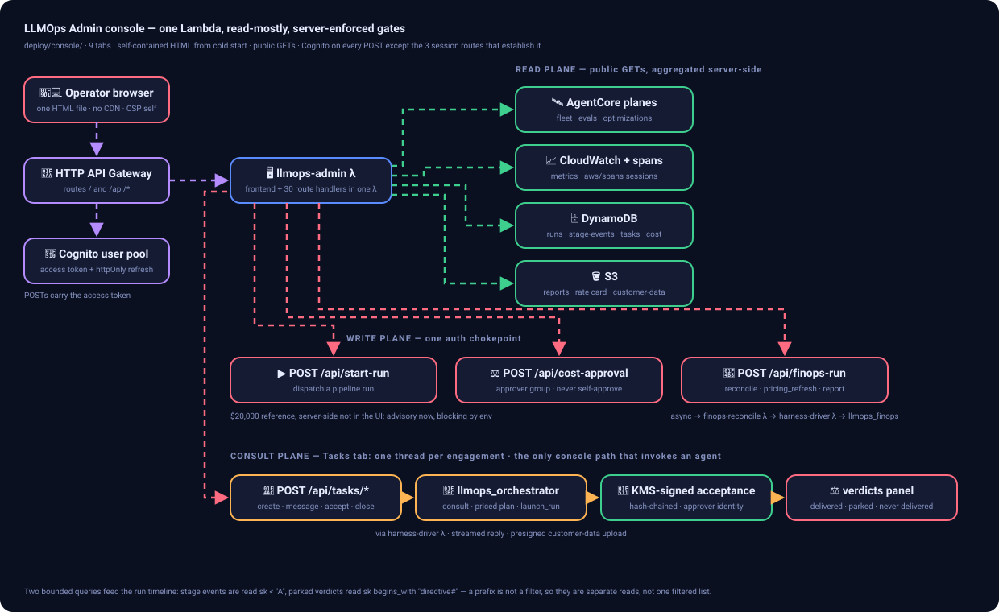

# 架構 —— 設計論證

[English](ARCHITECTURE.md) · [README](../README.zh-TW.md) · [基礎設施](INFRASTRUCTURE.md) · [觸發器](TRIGGERS.zh-TW.md) · [測試結果](TEST_RESULTS.zh-TW.md)

以下每個決策都經過真實 AWS 帳號上的真實調用驗證（證據見
`deploy/evidence/VERIFICATION_phase*.md`）。凡是被實測證據*改變過*的決策，都會引用那次事件。


## 1. 七個 harness（5 個專家 + 1 個指揮家 + 1 個審計員），而非巨型 agent

平台由七個 AgentCore Harness 組成：

| Harness | 角色 | 任務 |
|---|---|---|
| `llmops_data_prep` | 專家 | verify, generate, curate |
| `llmops_finetune` | 專家 | prepare, launch, analyze, remediate |
| `llmops_eval` | 專家 | evaluate, gate |
| `llmops_deploy` | 專家 | deploy, smoke, teardown |
| `llmops_monitor` | 專家 | health, sweep, report |
| `llmops_orchestrator` | **指揮家** | plan, triage, report |
| `llmops_finops` | **審計員** | reconcile, pricing_refresh, report |

為什麼不做一個掛滿所有技能、擁有所有權限的巨型 agent：

- **按階段掛載技能** —— 每個 harness 只掛載自己階段的技能（來自
  [MLOps-agent-skills](https://github.com/timwukp/MLOps-agent-skills)；例如 finetune 掛
  `llm-fine-tuning`、`llm-distillation`、`llm-cost-optimization`，eval 掛
  `llm-evaluation`、`llm-guardrails`）。巨型 agent 的每一輪上下文都得背著全部技能。
- **按階段版本化與 endpoint 釘選** —— 改動 deploy agent 不可能弄壞 data-prep agent；
  每個 harness 獨立版本、獨立釘選。
- **按階段最小權限 IAM** —— 爆炸半徑小。Phase 4 的 teardown 證明了價值：deploy agent
  的 role 被拒絕 `List*`/`DeleteModel`，於是它以已知名稱規劃刪除，並*如實標記*自己
  做不到的部分，而不是默默宣稱完成。
- **按階段評估** —— 線上 evaluation 逐 harness 掛載，質量退化能定位到具體階段。
- **各自誠實** —— Phase 2 pilot：`llm-cost-optimization` 刻意*不*掛在 data-prep 上；
  agent 主動聲明自己無法交叉核對價格，而不是瞎猜。職責分離讓這條邊界成為真的。

指揮家位於狀態機*之上*，而非其中：它把自然語言目標解析成 run plan、派發運行、對
escalation 做第一線 triage、彙總跨運行報告。它不執行管線階段，也不排程運行內的步驟。
配置註釋說得最好：**樂譜不即興，指揮家不吹每個音符**。

## 2. 確定性主幹 + 智能 worker

階段 DAG（data-prep → finetune → eval → deploy → monitor）不會因運行而變 —— 完全不需要
LLM 判斷。因此編排採用 **Step Functions Standard 狀態機**，智能封裝在每個階段*內部*。
讓 LLM 決定「下一個階段是什麼」只會給系統中唯一不需要不確定性的部分添加不確定性、
成本和故障模式。

狀態機（`orchestration/state_machine.asl.json`）在正常路徑上有 **12 個 harness 任務狀態**
—— 每個都是帶 `waitForTaskToken` 的 harness driver Lambda 調用 —— 外加只在迴路中出現的
`RemediateFinetune`、只在審計模式出現的 `DataAudit`，以及（在 `eval_only` 模式下）
一個從這同一條路徑中途、也就是 eval 階段進場的入口：

```
DataPrepGenerate → DataPrepCurate → FinetuneLaunch → FinetuneAnalyze → EvalGenerate → EvalScore → EvalGate
                                                        │（門檻失敗）
                              RemediateFinetune ←───────┘   …門檻通過則：
             Deploy → SmokeTest → MonitorHealth → Teardown → MonitorReport
```

**三種入口模式，由 `StartAt` 的一個 `Choice` 讀執行輸入裡的 `pipeline_mode` 決定**（它讀不到
S3 上的 manifest，這正是模式必須搭在輸入裡的原因）。`full` 就是上面那條 `Default`。
`data_audit` 是指揮家最便宜的開胃菜：稽核客戶資料，然後在任何 GPU 出現之前停下。
**`eval_only`** 從 `EvalGenerate` 進場，重新評判一個先前 run 已經產出、也已經付過錢的 artifact，
並由 `EvalOnlyStopChoice` 停在門檻判決上 —— 通過**不會**走到 `Deploy`，失敗也**不會**走到
`RemediateFinetune`。這兩半都是刻意的：重新量測一個 artifact 不等於批准把它上線；而這份
manifest 裡根本沒有 finetune 階段可供補救，所以補救路徑只會在「唯一刻意跳過訓練的模式」裡
開起 GPU 訓練。這個模式在派發時就會被拒絕，除非 plan 同時指名 `model_artifact_uri`（這個 run
裡沒有任何東西能產出它）與 `customer_eval_uri`（eval agent 平常退回去用的 10% val split，
是由這個模式跳過的 `curate` 任務寫出來的）—— 見 start-pipeline 的 `MODE_REQUIRED_PARAMS`：
一個只能走向升級的 run，不該先拿到 run id、manifest 和 `PipelineStarted` 事件。

它的存在來自 r6c：一次 8B 的 run 產出了 12.2 GiB 的模型，改良後的裁決指標必須重算它的分數，
而在只有 `full` 和 `data_audit` 的時候，唯一的做法是某人工作目錄裡的一支腳本 —— 沒有版本、
沒有稽核紀錄，在 runs 表裡也看不見。

兩個 monitor 狀態的位置是由工作本身的形狀決定的，不是喜好問題。**`MonitorHealth`** 必須在
端點還存在時讀 CloudWatch，而 `Teardown` 在每條路徑上都會刪掉它（包含 `SmokeTest` 的
`Catch`）—— 刪除之後 `GetMetricData` 回傳的空序列，跟一個健康但閒置的端點完全無法區分，
所以這兩個狀態之間是唯一能回答這個問題的窗口。它不作為門檻：它的 `Catch` 同樣指向
`Teardown`，因為一次失敗的指標讀取絕不能把它正在觀測的端點卡在原地 —— 不管我們有沒有量到，
孤兒端點都在計費。**`MonitorReport`** 排在 `Teardown` 之後，因為它整合的是*已完成*的
manifest —— 更早寫的報告會漏掉它本來要確認的 teardown —— 而它的 `Catch` 指向 `Complete`：
敘事是交付物，run 的終態是事實。

第三個 monitor 任務 **`sweep`** 刻意留在狀態機*之外*，跑在 08:00 UTC 的排程上
（`llmops-monitor-sweep-daily` → `llmops-monitor-sweep`）。它獵捕的是*其他* run 留下的端點，
包括那些崩潰、因此從未走到任何能檢查的狀態的 run —— 一個綁定單一 run 的 agent 無法替其他
run 回答。這個帳號本身就是證據：它唯一站過的那個端點
`jumpstart-dft-hf-asr-whisper-large-v2` 從 2024-04-11 起 InService，直到 2026-08-02 被刪除，
期間完全沒有 `project` 標籤，所以從來不會有哪個 run 對它負責；也因此它的 `ListTags` 權限
必須是帳號層級的（`Resource: "*"`）。端點刪掉之後這個權限仍然保持寬的，理由和一開始放寬它
的理由完全一樣：sweep 存在的目的是找出*下一個*沒有人認領的資源，而把範圍限縮成「我們已經
認領的東西」，正是這一個能在它 843 天的生命裡無聲計費到底的原因。這條邊界是**讀取放到帳號層級、寫入只限 `llmops-*`** ——
`ListEndpoints`/`ListTags`/`DescribeEndpoint`/`DescribeEndpointConfig` 都在 `"*"` 上，
所有的變更操作仍然窄範圍：sweep 能把一個它動不了的孤兒端點**完整刻畫出來**。這條線之所以
畫在「讀 vs 寫」而不是畫在 `Describe`，是第一次實測 sweep 逼出來的。它找到了那個端點，
然後在自己的輸出裡記下一條權限缺口：`DescribeEndpoint` 當時被限縮到 `endpoint/llmops-*`，
所以它唯一標記出來的那個端點背後的機型讀不到，於是它的頭條數字（約 $1106/月、自 2024-04-11
起累計約 $30.6k）是**猜** JumpStart 預設機型猜出來的。**一個頭條數字是假設的成本發現，
owner 可以理直氣壯地不理它** —— 而那個數字就是這條發現的全部價值。看起來最順手的修法
（把 lifecycle 那條 statement 放寬）會把 `DeleteEndpoint` 在整個帳號範圍交給一個
prompt 明文禁止它刪東西的 agent。

再加上路由用的控制狀態：`QualityGateChoice`（門檻通過 → Deploy，否則進補救）、
`RemediationChoice`（iteration < 3 → 補救，否則升級人類）、`IncrementIteration`（Pass），
以及終態 `Complete`（發出 `PipelineCompleted`）、`EscalateFail`（發出
`EscalatedToHuman`）、`Fail`。

兩個屬於「政策」而非「管道」的主幹細節：

- **兩條路徑都要關掉兩筆記錄。** 一次 run 會寫兩筆記錄 —— `llmops-pipeline-runs` 裡它自己
  那一列，以及 `llmops-tasks` 裡發起它的那個任務 —— 而兩條路徑都各被抓到只關了其中一筆。
  失敗路徑（`EscalateFail` → `MarkRunFailed` → `MarkTaskFailed`）關了 run 卻沒關 task，
  害 `task-58ecde82adcd73bf` 卡在 `dispatched` 整整一天。接著是成功路徑：`runs.status`
  從頭到尾只被寫過 `running`（start-pipeline）、`escalated`（driver）、`failed`
  （`MarkRunFailed`）—— **沒有任何東西寫過 `completed`**，所以每一次成功的 run 都變成殭屍，
  正是 `MarkRunFailed` 在另一條分支上要防的那件事。它之所以沒被看見，是因為在
  `run-20260801T062313Z-4d3e2e69` 之前**從來沒有一次執行成功過**（6 次失敗、1 次中止）；
  那次 run 的 task 列在 06:34:43Z 正確關閉，而它的 run 列在五小時後仍讀作 `running`。
  現在 `Complete` → **`MarkRunDone`** → `MarkTaskDone` 把它關掉，並帶
  `attribute_not_exists(status) OR status = running` 條件，所以它永遠不可能覆蓋掉更豐富的
  判決；它的 `Catch` 也落到 `MarkTaskDone`，理由和 `MarkRunFailed` 的 `Catch` 一樣 ——
  關不掉其中一筆，不能連另一筆也一起開著。守護測試從 ASL 推導出「誰負責關閉」，而不是寫死名字。
- **「關掉一個 run」和「鑄出一個 run」是同一個 DynamoDB 呼叫。** `update_item` 是 upsert：
  對一個沒有列的 key，它會用 key 加上 `SET` 寫的東西**建立**一列。所以 driver 的
  `handle_escalate` —— 它的意圖只是「把這個 run 標成 escalated」—— 為每一次「由不是 run 的東西」
  發出的升級，實際上都新建了一個 run：一列只有兩個屬性的
  `{run_id, status: escalated}`，沒有 `created_at`、沒有 `trigger_source`、沒有 `iteration`。
  實例：**`sweep-2026-08-01`**，來自排程的孤兒端點 sweep。sweep Lambda 不是元凶，而且它根本無力
  阻止：它把自己的記帳列寫進 stage-events 表，而且它的 docstring 明確寫出了為什麼一次 sweep
  絕不能讀作一次 run（console 會把它列成 run、審計員會去對帳它的成本、每份文件引用的 run 總數
  會每天多一）。是 driver 代它寫下的，透過一條 sweep 並不知道存在的路徑。這件事的第一版修法
  列舉了當時已知的那**一個**非 run 呼叫者（`stage == "finops"`）—— 而這正是後來才加入、跑在自己
  合成 `sweep-<date>` id 上的 sweep 會原地踩回同一個坑的原因；triage 的 `triage-<subject>`
  是同一個形狀。所以這道守衛不是在「哪些 stage 不是 run」的清單上再加第三筆，而是一個
  `ConditionExpression: attribute_exists(run_id)`：**只有 `start_pipeline` 會建立 run 列，
  所以要問的問題是「這一列存在嗎」，而回答它的正是表自己。** 條件被拒絕就是答案，安靜返回；
  其他任何錯誤仍然拋出 —— 因為在這裡吸收一次限流，會讓一個真的升級了的 run 留在 `running`，
  也就是上一條所講的那種殭屍，被下一條的修法重新造了一次。而且這次才發現，那個寫列的動作一直在
  代替一筆從來沒被寫下的紀錄：`handle_escalate` **完全不寫** stage event（`handle_page_human`
  會寫），所以一次升級從來沒有出現在 console 依 `llmops-stage-events` 繪製的時間軸上 ——
  對一個真的 run 來說，`runs.status` 就是唯一的持久痕跡。若只是拒絕寫列，對 sweep 而言就變成
  「兩張表都沒有痕跡」，所以現在**兩條路徑**都會把升級記進 stage-events，並帶上 `run_row`
  說明走的是哪一條。這筆寫入屬於記帳，且被包住：events 表寫失敗絕不能扣住 SNS 通知或
  `EscalatedToHuman` 事件。
- **一次升級的各條通道是獨立的，而那條「送不到任何人」的絕不能當成閘門。**
  `handle_escalate` 用四種方式通知：SNS 寄給人、stage event 給 console 時間軸、bus 上的
  `EscalatedToHuman` 給 conductor、以及 `send_task_failure` 放掉狀態機。而 SNS publish 原本是
  **第一個** 敘述且沒有包起來，所以一次 publish 失敗會把其他三個一起帶走 —— 包括那個 settle，
  於是一個已經升級的 run 上還掛著活的 task token，只能等該 stage 自己的 timeout
  （自 2026-08-03 起，每個做長工作的 state 都是 86400s，也就是整整一天）才被釋放。
  而這在**這個**呼叫上是最糟的閘門選擇：
  發現當時**`llmops-escalations` 的訂閱者是零**，SNS 正是那條已知送不到任何人的通道。
  `deploy/03_storage.py` 的 `ensure_topic` 會把它報成
  `NO SUBSCRIBERS — every escalate_human call publishes into the void`，而不是把 topic
  報成健康，因為部署沒辦法憑空發明一個地址；解法是 `--escalation-email <addr>`，已於
  2026-08-02 提供，且 `PendingConfirmation` 現在已是 `false`，topic 有一個已確認的收件人。
  但那是兩步而不是一步，`ensure_topic` 之所以把 pending 單獨報出來正是為此：email 訂閱在收件人
  點擊確認連結之前雖然「存在」卻送不到任何人，那只是把同一種沉默往後挪了一步，而部署沒辦法
  代替他點。所以下面的排序仍然是必要的，不是被取代了：一條通道的聽眾可以在沒有任何程式碼變動的
  情況下重新變成零。現在每一種通知都各自被包住並記錄，順序依「失去它的
  代價」遞增排列：先 SNS、再時間軸那一列、再 bus 事件，最後才是 token settle —— 好讓即使所有
  通知都失敗，它仍然會發生。
- **就緒檢查清單必須從 prompt 推導出來，不能從它抄一份。** console 的 Data-readiness 面板存在的
  意義，就是逐題呈現 orchestrator 的 consult protocol 要求 agent 回答哪些問題、以及哪些還沒答。
  但它的守門測試自己重述了七個路徑並斷言 console 含有它們 —— 於是測試同時同意 console 也同意
  自己，而 prompt 的 `data` 區塊其實指定了**九個**。線上實況是：面板少了
  `datasheet.provenance`（沒有來源，授權條款幾乎沒有意義）以及 `readiness_report_uri` ——
  指向 Data Readiness Report 的連結，而審核的 PII 掃描結果正是落在那份報告裡。客戶因此可能讀到
  一個看起來很完整的面板，看見 `PII disposition: redacted` 這個寫在計畫裡的宣稱，卻拿不到任何
  通往那份「真的檢查過資料」的產物的連結。現在面板與它的守門測試都源自
  `agents/orchestrator/harness.json`：`tests/test_console_tasks.py` 的
  `_prompt_data_block_keys()` 直接從 prompt 解析該區塊，另有一個測試斷言這個推導仍然是推導，
  而不是又一份寫死的清單。規則與「文件裡的測試數」守門一致 —— 當事實來源是一段模型 prompt，
  就去解析那段 prompt。（`frontend.html` 的 `renderReadiness` 是由 API 的 `fields` 驅動的，
  所以補回的兩列不需要動前端。）
- **沒有任何東西掃過客戶的資料，而每一個訊號都說有。** 上面那個就緒面板會連到 Data Readiness
  Report，而該報告的 PII 段落是**啟發式 regex** 掃描 —— data-prep 的 prompt 就是這樣寫的。任何人想
  確認「是不是還有更嚴謹的」，看到的是 Macie session `ENABLED` 加上一個 COMPLETE 的分類作業，讀起來
  就是「有」。但那個作業是 `ONE_TIME`、建立於 **2021-02-23**、指名 25 個無關的 bucket、處理了
  **0 個物件**；`customer-data/` 根本沒有被任何東西掃過。現在 `deploy/03_storage.py` 的
  `ensure_pii_scan` 會在部署輸出裡用獨立一行回答真正的問題，而 `macie_job_covers()` 是依「bucket
  清單**加上** scoping」來判斷 —— 一個作業可以指名我們的 bucket 卻只讀 `runs/`，而
  `bucketCriteria` 型的作業會被報成「無法判定」，而不是被算成有覆蓋。建立作業是選擇性加入的
  （`--enable-pii-scan`）：`SCHEDULED` 作業是按 GB 反覆計費的工作，靜靜地把它開起來，等於是帳單版的
  「無聲安全降級」。有兩個 API 限制決定了它的形狀，而兩者都沒寫在文件裡：
  `UpdateClassificationJob` 只接受 `(jobId, jobStatus)`，所以作業的範圍是不可變的，錯的那個必須取消
  而不是收斂；而 `CreateClassificationJob` 的 `clientToken` 意味著重跑一次會建立**第二個**掃描器，
  所以幂等性只能靠先用名字找出我們自己的作業。而讓上述一切變得有意義的那個發現是：harness 執行角色
  對每一個 `macie2` 讀取動作都是 **implicitDeny**，也就是說掃描會照樣計費，卻對那個真正撰寫報告的
  agent 完全不可見 —— `MacieFindingsReadForDataAudit` 修掉這點，且雙向都是唯讀（不能建立作業、也不能
  停用 session）；audit 的 prompt 現在也必須在沒有任何覆蓋時明確寫出
  「no Macie classification job covers this data」。
- **system prompt 在每一次模型往返都會重送，而且完全沒有快取；而兩條想快取它的路，都會靜靜地
  丟掉 harness 的狀態。** 實測一次 consult turn：`wall=59.0s ttft=26.4s rounds=2
  model_ms=52030` —— 88% 的牆鐘時間都是模型，而兩輪加起來 `in_tok=31691`，等於那份約 11 KB 的
  prompt 付了兩次錢。InvokeHarness 沒有任何快取欄位，但 `bedrockModelConfig.additionalParams`
  是原封不動轉給 ConverseStream 的，所以 `cachePoint` 真的塞得進去，也確實有效
  （`cacheWriteInputTokens 3568` → `cacheReadInputTokens 3568`）。但它仍然是錯的槓桿：
  `additionalParams.system` 會**取代**harness 的 prompt（同一個 agent 對它剛剛才答對的問題改回答
  `NO-PROTOCOL`，而 input token 反而*下降* 10840 → 6644）；`additionalParams.messages` 會**取代**
  session 歷史（上一輪才記下的暗號回答 `NONE`）；而把 `GetHarness` 的 prompt 原樣送回去也不行 ——
  那會丟掉 runtime 注入、控制平面卻從不回傳的 skills 清單，共 1148 個 token，之後 agent 只列得出
  4 個 skill 中的 2 個。**每一條錯的路，看起來都是 token 變少、又有 cache hit。** 在 InvokeHarness
  真正開放快取之前，槓桿是**減少往返次數**，不是讓每次往返變便宜。
- **prompt 沒有點名的 mounted skill，就是一個沒有人叫 agent 去讀的 skill。** orchestrator 掛了
  四個、prompt 只名了兩個；而沒被名到的 `llm-data-preparation` 正是它自己 consult 協議第 0 步的
  方法論。原有的守衛通過了，因為 mount 本身是真的。真正說出「consult them before acting」的是
  prompt，所以守衛現在改成從每個 harness 的 `skills` 清單雙向推導。
- **用 read-modify-write 實作的「append-only」log，離被清空只差一次暫時性錯誤。** Tasks tab
  的 S3 稽核副本原本會把整個 `transcript.jsonl` 讀回來、接上、再寫回去，而讀取失敗被當成
  「檔案還不存在」吞掉 —— 於是一次 503 就把整段歷史換成最新那幾行；而兩個寫入者（`close_task`
  在回合進行中是允許的）會靜靜吃掉對方的訊息。現在改成**每次 append 寫一個帶時間戳的新物件**：
  沒有讀取、沒有東西可被覆寫，key 的字典序就是時間序。同樣這十二行裡還有兩個相關的錯：8000 字元
  的上限被套用在 DynamoDB/S3 **分流之前**，所以「全文」副本其實是一份被截斷紀錄的截斷副本
  （實測有一則 **assistant** 回覆 —— 正是簽署承諾時所針對的那種訊息 —— 在兩邊都剛好停在 8000）；
  而稽核寫入沒有被包起來，一次 S3 失敗就會跳過它後面的 `PlanAccepted` 事件與 worker 派發，
  讓一份 KMS 已簽的承諾卡在 `accepting`。**沒有任何東西會把這個產物讀回來，這正是它壞了卻沒人
  發現的原因 —— 只寫不讀的產物，要靠讀它來驗證。**
- **門檻的輸入由讀它的那條路徑產生。** `EvalGate` 對 `evaluation/report.json` 套用閾值；
  在 `EvalGenerate` 被插到它上面之前，**沒有任何東西派發那個寫出報告的任務**。`evaluate` 和
  `gate` 兩者都寫在 eval harness 的 prompt 裡，但只有 `gate` 出現在 ASL 中 —— 於是管線唯一
  能跑的 eval 任務，讀的是一個沒有任何路徑產生過的輸入：管線從來沒有走過
  `evaluate → gate`。門檻的 fail-closed 規則（`metrics.get("gate_passed") is True`，它本身
  正確且在別處承重）把這件事藏得完美：**因為報告從未被產生而失敗的門檻，和因為模型真的不夠好
  而失敗的門檻，讀起來一模一樣。** Phase 4 的 FAILED 判決之所以站得住，只因為 eval 是*直接*
  跑的、在狀態機外面；同樣的判決若經過狀態機，將是不可否證的。完成時現在也會發出
  `ModelEvaluated` —— 它本來就在事件詞彙表（`pipeline/contracts/events.py`）裡，卻沒有任何
  東西發出過，是同一個缺口的另一面。守護測試把每個 harness prompt 宣告的任務，和每個派發者
  真正送出的任務做差集，剩下的孤兒是一份明列的白名單，而不是一個數字。
- **deploy 之後必然執行 `Teardown`** —— 即使 `SmokeTest` 失敗，其 `Catch` 也先路由到
  `Teardown`。孤兒 endpoint 是第一大成本風險（Phase 4 就在帳號裡發現一個無關的
  endpoint 自 2024-04 起一直 InService）。
- 主幹同時是**確定性後備**：Phase 3 一次 Bedrock 短暫故障期間，agent 不可達，
  orchestrator 直接提交了訓練作業 `-r5`（標記
  `launched_by: orchestrator-fallback-bedrock-5xx`）。

## 3. Inline-function 契約

Agent 不用自由文本「彙報」—— driver 只信任結構化的 inline-function 呼叫，這是 agent
影響管線的唯一通道。

**Worker 契約**（5 個專家通用）：

| Function | 含義 | Driver 行為 |
|---|---|---|
| `stage_complete` | 階段完成，附 outputs + metrics | **trust-but-verify**：對每個聲稱的 `s3://` 輸出做 `head_object`；缺失 → 呼叫被*駁回*給 agent（「寫出來再呼叫一次」）。規範報告由 driver —— 而非 agent —— 寫入。`outputs: []` 是合法的成功。 |
| `job_launched` | 長作業已發起（SageMaker 訓練） | launch-and-release：把 Step Functions task token 按 job name 停放進 DynamoDB，釋放 session（§4） |
| `checkpoint` | 回合預算將盡、進度已持久化，**或卡在需要人類決策** | 在同一 session 重新調用以繼續（Lambda 本身臨界時自我重調）。這是平台唯一**活著**的 human-in-the-loop 暫停：driver 會在下一回合把停放的 `{"status": "directive", ...}` 回傳給 agent，所以卡住的 agent 要靠 checkpoint 保住運行，而不是靠升級。 |
| `escalate_human` | 預算或權限耗盡 | **終止**：SNS 通知、運行標記 `escalated`、發 `EscalatedToHuman` 事件、task token 置失敗 → `EscalateFail` → `Fail`。`escalated` 在 `UNREACHABLE_RUN_STATES` 裡，所以事後送出的 directive 只會被記錄供稽核，沒有人收得到。 |
| `page_human` | 一個人類回答**有可能**解開的決策 —— 首先就是 borderline 的 gate 分數 | **通知，但不結束任何東西**：SNS 決策 brief 給 run owner、發 `OwnerPaged` 事件、在**這個 run 自己的** timeline 上寫一列 `HumanPaged`。它**不**交還這一輪，也**不**暫停 stage，所以一次 page 後面永遠接一次 `checkpoint` —— 那是 directive 唯一能抵達的呼叫。r6 起宣告在 eval harness 上，指揮家也有。 |

在這個契約裡，**跑的是哪個 stage、哪個 task，是 driver 的事實，不是 agent 的**。outputs、
metrics、evidence 都該由 agent 回報 —— 沒有別人知道。`stage` 和 `task` 剛好相反：driver 自己
的 invocation event 就帶著這兩個值，agent 那份充其量是覆述。過去這裡記的是 agent 那一份，於是
前兩次實測的 monitor sweep 都寫下 `"task": ""` —— 因為 agent 根本沒填這個欄位 —— 留下一列說
「某個 monitor stage 完成了」，卻沒說是 health/sweep/report 裡的**哪一個**：正是 §2 那條 sweep
接線要消除的歧義，只是在下一層又長回來。這也不只是好看的問題：console 是從這個欄位推導一次 run
實際跑過哪些 `(stage, task)` 組合的，而空的 task 會match**任何**同 stage 的 task，於是一次
sweep 的證據可能被借給一次從未發生的 health 檢查。現在是**派發值覆蓋** agent 的覆述，而不是
只在空白時補上 —— 因為危險的不是漏填的 task，而是填錯又填得很有自信的那個。

**指揮家契約**（`llmops_orchestrator`）：`launch_run`（經 start-pipeline 派發計劃好的
run）、`resolve_escalation`（政策範圍內第一線處置：調參重跑階段、跳過、有記錄的重試）、
`page_human`（**僅限**超出其權限的決策 —— 預算超支、共享資源刪除、業務取捨 ——
附決策簡報：情勢、選項、建議）、`write_report`（發布跨運行運維彙總），加 `checkpoint`。

**裁決要嘛被投遞，要嘛可見地無法投遞 —— 絕不靜默歸檔。** 回答通道
（`put_directive` → `checkpoint` 分支的 `take_directive`）**只有一個讀者**：一個
*活著的* driver invocation。所以「已投遞」不是寫入的屬性，而是「將來會不會有人去讀」的
屬性 —— 而 `resolve_escalation` 過去兩種情況都回 `{"status": "resolved"}`。這正是那筆
data-prep 預算 escalation 懸了三天的原因：`run-20260729T104648Z-41631739` 早已是
`escalated`，它的 task token 已被 `handle_escalate` 置失敗、execution 也在 11:19:55Z
FAILED，所以今天去 triage 它**會回報成功、然後什麼都不會發生**。那個為了回答 escalation
而存在的工具，回答不了*那一筆* escalation，而且沒有告訴任何人。這與 §4 那個滯留的 task
token 是同一個形狀：**寫入被授權了，但到不了。** 現在 `put_directive` 會先查該 run 的
狀態；終態 run 的裁決仍然會被寫下（決定本身就是證據，即使沒人照它行動），但標記
`deliverable: false`，並且**在同一輪把呼叫駁回**，明確指出仍然能動的路徑 ——
用 `launch_run` 帶著 adjusted params 重跑，或 `page_human`。讀不到或不存在的 run 列
**刻意**算作可投遞：要修的缺陷就是靜默無操作，若因為一次暫時性 DynamoDB 錯誤就扣住裁決，
等於朝同一個方向又造出第二個。

**逃生口必須在真正會用到它的那條路徑上被服務。** 上面那個駁回指出了兩條路，而其中一條
根本沒接線。`page_human` 從 Phase 5 就宣告在 orchestrator harness 上，卻只有 console 的
chat worker 處理它 —— 但 triage 從來不是 chat：`EscalatedToHuman` 事件路由到的是
**driver**，而在 driver 上 `page_human` 落到了未知工具分支，回答
`{"status": "unsupported"}`。沒有 SNS、沒有事件、沒有任何人被通知。2026-08-01 13:45Z
實測，而且是在上面那個修復**已經部署之後**：指揮家被正確告知裁決無法投遞、應改用
`launch_run` 或 `page_human`，於是它改為再次呼叫 `resolve_escalation`、再次被駁回、
把 `plan.json` 與 `relaunch-plan.json` 寫到 S3，然後那一輪就結束了 ——
**零次派發、零次呼叫人類。** 舊的漂移守護測試之所以通過，是因為它只問一個被宣告的工具
有沒有在**任何地方**被服務；console 讓它成立，而只有 driver 會跑 triage。現在守護測試
改為**逐路徑**，並且從 prompt 自己的 triage 條款推導工具清單，所以協議日後多長出第三個
出口，也不可能只接一半。此外，一次 page 若沒有同時帶 `situation` 與 `recommendation`
就會被駁回：把問題丟給 owner 而不附上你已經做完的分析，等於讓他們留在原地。

**被指名的逃生口，必須是一扇打得開的門。** 把 `page_human` 接到 driver 路徑上，只修好了
那個駁回的一半；另一半指向 `launch_run`，而它在一次 bus triage 上**根本不可能成功**。
`service_launch_run` 沒有可被 KMS 驗證的 approval 紀錄就會拒絕，而該紀錄只能來自
`args["approval"]` 或 `params.approval_context` —— 由 `triage_event_from_bus` 建出來的
triage 兩者都沒有：整個 repo 從來沒有任何地方寫過 `approval_context`（它是一個**有讀無寫**
的鍵），而 `approval` 也不在 orchestrator harness 為 `launch_run` 宣告的屬性裡，所以連
agent 自己都無法提供。指揮家被交了兩扇門，其中一扇是畫上去的。2026-08-05 至 08 實測：
9 個escalation 被分診過的 run 裡，**有 4 個完全沒有產生 `HumanPaged` 事件** —— 被送去一個
必定拒絕它的工具，它用完了所有的棋，那一輪就以散文結束。現在駁回只會指名**在這次呼叫上
真的可行**的出口：由 `dispatch_is_possible(event)` 判定，為 false 時理由會明講「只有人類
能授權一個替代的 run」，而 `page_human` 是唯一能改變任何事的路。當簽章 approval **確實**
存在時，派發的建議保持原樣 —— 一個把可行情況也一起砍掉的守護，等於把指揮家本來有權做的
決定丟回給 owner。

**在這條路徑上，指揮家不是人類的第一道防線 —— 它是唯一的一道。** triage 條款寫著它是
「FIRST line」，這對 driver 自己的 `handle_escalate` 成立（它會先發布到 escalation SNS
topic 才發事件）。但對狀態機的 `EscalateFail` 不成立：那是一個裸的 `events:putEvents`，
而 bus 上恰好只有一條 rule（`llmops-escalation-triage`）、恰好只有一個 target（driver），
整條路徑上**沒有任何 SNS**。所以一次沒有 resolve、沒有派發、也沒有 page 的 triage，
**誰都不會被通知** —— run 列讀作 `failed`、execution 讀作 FAILED，唯一的痕跡是一條
log stream。這正是這個缺陷看起來時好時壞、而其實是全面失效的原因：**歷來被 park 的 11 筆
directive，11 筆都是 `deliverable: false`**，而沒有收到 page 的那些 run，恰好就是指揮家
**聽話地**依照駁回去嘗試 `launch_run` 的那些。實際傷亡包括
`run-20260808T005301Z-c8b13faa`、`run-20260805T144522Z-86ab8a14` 與
`run-20260808T024809Z-b56281da` —— 每一個都是科學工作已經完成、而 owner 從未被告知就死掉
的 ARC-2 血脈 run。現在由 `_backstop_page` 收口：一次 triage 的結果若不在
`TRIAGE_ANSWERED` 裡，就在離開前 page owner，並明講這封 page 是 driver 的兜底、不是指揮家
的判斷。它包住的是 `handler` 的 `return`，而不是迴圈裡的任何一個分支，所以它涵蓋 triage
所有「沒有回答就結束」的方式 —— re-ask 用完後的散文、不支援的工具、被駁回的 page、什麼都
沒決定的 `stage_complete` —— 也涵蓋 crash 路徑：一次 bus triage 沒有 task token，
`send_task_failure` 因此也把消息帶給了沒有人。它在設計上就是 best-effort：一封發不出去的
page 不可以把「只是沒回答」的 triage 變成「崩潰」的呼叫，那是拿一個安靜的失敗換一個更大聲
的錯誤。

**一筆紀錄「是關於誰的」，由呼叫決定，永遠不由 agent 決定。** 兜底回答的是「有沒有 page
出去」，而那跟「owner 找不找得到它」不是同一個問題。一次 triage 跑在
`run_id = triage-<subject>` 之下，真正的主體是由 `params.escalation.run_id` 傳下來的 ——
而**沒有任何地方讀過那個鍵**。每一個消費端都改從模型自己的 tool 參數拿主體，再 fallback 到
`event["run_id"]`，於是一個省略 `run_id`、或把自己被呼叫時的 id 原樣回傳的指揮家，就把紀錄
寄給了自己。對現存每一筆 `HumanPaged` 列實測（12 筆，全表掃描）：**有 3 筆被歸檔在
`triage-` 開頭的 id 底下** —— `86ab8a14`、`c8b13faa`、`b56281da`，正是上面那三個 ARC-2
run：警報有響，而 owner 打開的那條時間線是空的。把參數改成必填並不是解方：`run_id` 根本不在
`page_human` 的 `required` 清單裡，卻**在** `resolve_escalation` 的清單裡，而模型照樣省略了
它 —— schema 的 `required` 對一個語言模型是一個請求，不是一個強制。現在由單一的
`triage_subject(event)` 服務全部三個呼叫點，agent 自己的值只在事件完全沒帶主體時才被採用
（console 聊天路徑，那裡 `event["run_id"]` **就是**主體）。同一段推導原本被寫成三份，而
`_backstop_page` 那一份是**對的** —— 這正是為什麼兜底自己發出的 page 是歸檔正確的那些，也是
為什麼這個缺陷看起來時好時壞。一次沒有指名任何 run 的 `resolve_escalation`，現在會被**駁回**
而不是被跳過：舊的 `if subject:` 會直接掠過 `put_directive` 與可達性檢查、落到
`{"status": "resolved"}` —— 一個落在 `TRIAGE_ANSWERED` 裡的狀態，於是兜底也一起安靜了 ——
一個沒有被回答的 escalation，被報告成已經回答。

**發出去卻沒有 rule 的事件，是一個沒有路可以走的承諾。** 上面那段說 `EscalatedToHuman`
事件「路由到的是 **driver**」。它並沒有。`llmops-pipeline` bus 從 Phase 1 到 Phase 5
一共掛著**零**條 EventBridge rule，而這個 detail-type 有三處在發、在這份文件裡被寫成會
路由到指揮家、而且有一個 driver 分支在服務它 —— 那個分支永遠不可能被觸達，`task="triage"`
從來沒有被派發過一次。在活的 bus 上這是最安靜的失敗：`PutEvents` 成功、事件落地、什麼
都沒發生。沒有錯誤、沒有 metric、沒有任何一行 log，因為「本來就沒有 rule」和「rule 掉了」
是同一個觀察。現在 rule 存在了（`llmops-escalation-triage`，掛在**自訂** bus 上 ——
旁邊那條 SageMaker rule 用的是預設 bus，因為服務事件只會落在那裡、搬不動，而把那個形狀
照抄過來，會得到一條在 console 裡活著、健康、卻永遠匹配不到任何東西的 rule），而哪些
detail-type **必須**有 listener，宣告在 contracts 的 `EVENTS_NEEDING_A_RULE` 裡，
所以這個決定是離線被檢查的，而不是從「剛好存在哪些 rule」推論出來的。

接這條線的過程中，有兩個 emitter 被迫**改名**，因為這個判別必須放在 EventBridge pattern
讀得到的地方 —— pattern 讀不懂散文：

- `_maybe_failover_model` 在廠商 5xx 突發後熱抽換模型，然後重試**繼續進行**。它卻以
  `EscalatedToHuman` 的身分宣告自己，把「informational, pipeline continuing」這幾個字
  埋在 reason 字串裡；這件事之所以無害，純粹是因為當時沒有人訂閱。第一條把這個
  detail-type 路由到 triage 的 rule，就會為一個剛剛自己痊癒的 run 去呼叫指揮家。
  它現在是 `ModelFailedOver`。
- `handle_page_human` **也**發 `EscalatedToHuman` —— 但一次 page 是指揮家**已經**分診完、
  判斷這個決定超出自己權限時才發出的，而 `EscalatedToHuman` 的意思是「該有一位指揮家來看
  這件事」。兩者共用同一個 detail-type，會讓新 rule 自己餵自己：escalate → triage →
  page → triage，每一圈都是一次真金白銀的 harness turn。它現在是 `OwnerPaged`，而且
  rule **另外**排除 `stage: orchestrator` 作為第二道防線。那個排除用的是 `anything-but`，
  而它對「根本沒有這個 key」的事件**不會**匹配 —— 所以本來只帶 `run_id` 與 `iteration` 的
  `EscalateFail`，現在也帶上 `stage`。少了它，每一次終態的 pipeline 失敗（也就是最需要
  分診的那些升級）都會被那個本來要保護它們的 filter 丟掉。

一次 triage 也跑在自己**專屬**的合成 `run_id`（`triage-<subject>`）上，而不是被升級的那個
run 的 id。`take_directive` 以 `event["run_id"]` 為 key，而 checkpoint 分支是它唯一的
呼叫者，所以一個用受害 run 的 id 發動的 triage，會把那個 run 自己被停放的裁決 ——
正是指揮家此刻正在寫的那一份 —— 取走，並當成來自負責人的指令收下。指揮家會變成在回答
自己。受害 run 透過 `params.escalation.run_id` 抵達，那正是 prompt 的 triage 條款本來就
會讀的欄位；而 manifest 用的是受害 run 的，因為 triage 自己沒有 manifest。這個 envelope
是在 driver 的入口用 Python 轉譯的，而不是交給 EventBridge 的 `InputTransformer` ——
理由跟這條 rule 存在的理由一樣：transformer 一旦引用到事件沒有的路徑就會靜默丟棄，
而這個 detail-type 的兩個 emitter 帶的 key 集合本來就不一樣。

**這個選擇把通道的正確性放進了部署裡，所以部署本身要檢查它。** 後來一次 driver 部署 ——
來自一個早於這項工作的分支 —— 送上了一個沒有 `triage_event_from_bus` 的 handler，而
`llmops-escalation-triage` 依然 ENABLED 且指著它。於是每一次升級都以原始 EventBridge
envelope 抵達 driver，在任何 handler 分支跑起來之前就死在 `KeyError: 'run_id'`。
**所有離線守衛都看不到它**，而這才是重點：它們拿 `EVENTS_NEEDING_A_RULE` 去比對
**這棵樹**的部署器所建的 rule，所以一個既沒有宣告、也沒有 rule、也沒有轉譯器的分支，
是完全自我一致而且全綠的。一棵樹無法知道 bus 上有哪些 rule 是活的；只有 bus 知道。
因此 `07_lambdas.py` 現在會在部署時、在 `update_function_code` 之前問 bus：對每一條指向
正在部署的函式的 ENABLED rule，它投遞的每個 `detail-type` 都必須在
`BUS_DELIVERY_TRANSLATORS` 裡有宣告，並且在即將上線的 handler 裡有**定義** —— 或者那條
rule 的 target 帶著 `InputTransformer`，因為兩者是替代關係。有落差就 `SystemExit`，不是
警告，理由跟 `config_subst.resolve()` 會 raise 一樣：兩種情況部署都會報成功，所以警告沒有
人會讀。連不上 bus 時回報 `unchecked` 而不是乾淨 —— 把「我看不到」回報成「沒有不一致」，
等於把這整節存在的目的所要消除的那個歧義重建一次。

**prefix 不是 filter。** 上面那個回答通道把裁決停放在 `directive#` 這個 sort key 下，而那個
常數自己的註釋聲稱這個 prefix 讓它們「不出現在 console 渲染的 timeline 裡」。兩個 console
reader 都沒有對它做過濾 —— 而這個 prefix 讓結果比「無害」**更糟**，不只是沒被投遞。
`"d" > "2"`，所以每一個 `directive#` row 都排在所有 ISO 時間戳的 stage event 之後，正好落在
操作者看得到的那個窗口裡（`evs.slice(-25)`）；而 directive row 沒有 `detail` 屬性，於是每一個
都渲染成一條空白列。一個有 30 筆事件的 run 上停放 10 筆裁決，就會顯示 10 條空白列，
**並且把最新的 10 筆真實事件擠出畫面** —— timeline 的退化程度，正比於這個 run 需要過多少
分診。修法是**兩個各自有邊界的 query**，而不是一個過濾後的清單：單一個帶 `Limit` 的 query
會在事件抵達 Lambda 之前就把額度花在 directive 上，事後再過濾只會得到一份變短的 timeline，
而且沒有任何跡象顯示有東西被丟掉。事件範圍的上界取 `"A"` —— stage event 的 key 是 ISO
時間戳，所以一定以數字開頭，而每一個非事件的 row 都用具名的 `word#` prefix —— 而**不是**取
`directive#`：那樣只會修掉症狀，並且為下一個新增的 prefix 重新上膛（`audit#` 與 `checkpoint#`
排在 `directive#` **之前**，會被當成 stage event 送出去）。directive 是被回傳並且渲染成自己
一個區塊的，帶著 `deliverable` / `delivered`，因為一筆永遠不可能被讀到的裁決，不能長得跟一筆
agent 真的照著做了的裁決一樣 —— 那種無法區分，正是 data-prep 那筆 escalation 三天裡一直
讀起來像已被回答的原因。

若一輪結束時*沒有* inline-function 呼叫（模型有時會口頭宣稱完成卻漏掉結構化呼叫），
driver 在同一 session 內最多追問**連續** 2 次，然後以 `MissingStageComplete` 判定階段失敗 ——
口頭敘述永遠不會被晉升為成功。任何被服務的 tool call 都會重置這個額度：它計的是
「不再說協議語言的 agent」，而不是相隔一小時各失誤一次、之後已自行恢復的 agent。每個
fleet prompt 也把這份契約明寫為 TURN-END INVARIANT，點名該 harness 自己的終結工具，並附
write-first 規則（artifact 先落 S3，宣稱它的呼叫在後）—— 有一個 guard test 從各 harness
宣告的 tools 雙向推導這句話，讓它無法與工具清單漂移。

turn 的接力本身由**心跳 + 復活者**這對機制看守。driver 的自我重調是 async Lambda
invoke —— fire-and-forget，而 Lambda 真的丟過一次（run 68cfa9c8 token 停泊、Step
Functions 仍 RUNNING，卻死寂九小時）。driver 現在在每一輪開始前把 `driver_beat_at`
與精確的重調 payload 蓋在 run row 上；排程的 `llmops-resurrector`（每 15 分鐘）對
任何「beat 過期且**沒有停泊 task token**」的 running run 重調 driver —— 有停泊 token
表示 launch-and-release 正按設計等待 SageMaker 作業，那個喚醒屬於 resume_pipeline。
認領以掃描時讀到的 beat 為條件（不會重複復活），每個 run 有上限（超過就升級：每輪
都死的 driver 有真缺陷，復活只是重演它）。

Triage 走另一扇門獲得同樣的保護（#37）：它刻意沒有 run row，被拒絕的 runs-table
心跳改寫進 events table 專用的 `__liveness__` 分區 —— payload 帶上 `params`，因為
triage 的工作單只存在於調用本身。復活者用一個 Query 讀那個分區，套用同一套
stale/cap/claim 契約；正常終結會**刪除** item（結束不是死亡，刪除也不留下不朽的
歷史或被繼承的復活計數），觸頂的 item 則以 triage **所關於的那個 run** 為主體升級
—— 絕不用它自己的 `triage-` id —— 並隨升級一併刪除。排程作業（sweep、finops）刻意
**不可復活**：崩潰的排程等下一次排程，而不是重跑非冪等的工作。

這整條迴圈現在是**對已部署 bundle 的實測驗證**，不再只是單元測試：`tools/probe_liveness_resurrection.py` 下載 Lambda 現在真正在跑的程式碼，用一個合成 triage 對著真實的 events 表把 beat → sweep → 認領 → 復活 → 上限升級 → 終態刪除整條走完，2026-08-12 **18/18 通過**。它之所以存在，是因為這是唯一一條「健康」與「壞掉」讀起來一模一樣的路徑 —— triage 大約一個月才死一次，所以`checked_liveness: 0` 在幾乎每一天都正常，而「Query 打錯分區」、「少了 `dynamodb:Query`」、「兩個各自打包的副本對 `__liveness__` 這個字串不一致」，會產生完全相同的讀數。它殺掉的六個 mutant 見 TEST_RESULTS。

兩半都會在結束時把「檢查了什麼」**印出來**，因為排程的 invoke 是非同步的，handler
回傳的計數沒有任何人讀。這對非 run 的那一半尤其重要：只要當天沒有 triage 死掉，它
的健康狀態就是 *零* 個 beat —— 沒有那行 log，一次完美運作的掃描和一次瞄錯分區的
Query 留下的痕跡一模一樣：開始、結束、寂靜。印出的計數是「那個分區確實有被讀」的
唯一常設證據。

不過「印出來」不等於「有人發現」，而很長一段時間裡沒有任何東西發現。2026-07-29 到
2026-08-12 之間，Lambda **丟掉了 19 次非同步 invoke**（driver 11、resume 8）——每一次
都是一個 stage 停住、token 還被 park 著——而這個系統的所有函式上，CloudWatch alarm
一個都沒有：那次九小時的死亡是人翻執行歷史發現的，resume 少掉 `events:PutEvents` 授權
是人隔了一天翻 log 發現的。`deploy/06_observability.py --alarms` 現在建立十三個 alarm，
分三族，每一族偵測的東西另外兩族看不到。**`<fn>-errors`**（*任何一支* deploy script 建立
的每一個函式，而且是從每一支推導出來的，所以新增一個 Lambda 不可能沒人看）是主偵測器：
那 19 次丟棄全部落在當天也有 function error 的日子，而 resume 的比例正好是 3——一次嘗試
加上兩次預設重試——所以這一族永遠先響。之所以是從*每一支* deploy script 推導、而不是從
一支：一支已經被實測證明不夠——原本這份普查只讀 `07_lambdas.py`，於是這個帳號實際跑的
第八支函式（`llmops-admin`，每一次 plan 簽名與每一次人工裁決都走過的 console API，三天內
17,007 次 invoke）因為是 `deploy/console/deploy.sh` 建立的，直到 2026-08-12 之前三族
alarm 一個都沒有。**`<fn>-silent`** 蓋的是三個「沉默本身就是故障」的排程函式；
那裡的 `TreatMissingData` 必須是 `breaching`，因為沒被 invoke 的 Lambda 送出的是**沒有
資料點**而不是 0，用平常的 `notBreaching` 這個 alarm 會永遠停在 INSUFFICIENT_DATA，剛好
偵測不到它存在的唯一理由。`llmops-start-pipeline` 刻意沒有：它的 nightly 排程出廠是關閉
的，而一個永遠紅著的 alarm 只會教會維運的人忽略整組。**`<fn>-async-dropped`** 留下來不是
因為它更早，而是因為它的**意義不同**——重試成功的 error 是自己好了，被丟棄則是工作沒了。
狀態機上沒有 `ExecutionsFailed` alarm：一個誠實地沒過品質門檻的 run，是這條 pipeline 正常
運作，不是事故。

Log 的問題正好是鏡像：保留政策**存在**，但被套在沒有流量的那個面上。`setup_observability.py`
從一開始接 delivery 就把它建的 log group 壓在 30 天——但實測到 2026-08-12 的七天裡，那些
group 收到 **0 bytes**，而這個系統吃進去的 1236 MB 裡有 **1225 MB** 落在
`/aws/bedrock-agentcore/runtimes/<id>-DEFAULT` 和 `/aws/lambda/llmops-*` 這些**永不過期**的
group 上。這兩種都是 AWS 自己建的、不是這個 repo 建的，所以這裡從來沒有任何東西對它們設過
政策。`--retention` 把同樣的 30 天套到這個系統會寫入的每一個 group，來源是兩個、因為建立者
是兩個：Lambda 的 group **從 repo 推導**（跟 alarm 用同一份普查，所以一個函式不可能「有人看
但沒有期限」），AgentCore 的 group **從帳號探索**——它們的名字帶著這個 repo 從來看不到的
harness id 與 runtime id，改用 `HARNESSES` 拼名字只會在有流量的那些 group 旁邊多建五個空的，
這是試過、量過、然後丟掉的做法。同前綴但不屬於我們的 log group 一律不動：這個帳號是共用的，
別的專案的資料保留期不是我們該決定的。

這對機制唯一蓋不住的，是 session 自己的時鐘。AgentCore 會在 `maxLifetime` =
**28800 秒（8 小時）**收回 runtime session —— 這是硬上限，活動不會重置它，也沒有設定
能調高。蒸餾 stage 在單一確定性 session 裡跑 8–12 小時，於是活得比 session 久；跨過
那條線的 invoke 會以「一般 runtime 錯誤」的樣子失敗：driver 會把 stream 搶救重試、
接著把 re-ask 額度，全花在一個永遠不會再回話的 session 上。所以 driver 改為在上限
**之前**主動輪替。每個 stage 在 continuation payload 裡帶一個 **session epoch**；在
turn 之間（絕不在 turn 中間 —— 那時有未被回答的 `toolUse` 懸著）一旦超過
`SESSION_ROLLOVER_S` = 25200 秒，就把 epoch 加一、開啟 `…-e<N>`，並以任務 payload 加上
一段續作指示重新播種 —— 待處理訊息無法隨行，因為它通常是一個 `toolResult`，回答的是
新 session 從未發出過的 `toolUse`。什麼都沒丟：每個 stage 的狀態都在 S3，這正是
2026-08-08 那次人工復活之所以有效的原因。epoch 是**被攜帶**的、絕不由呼叫當下的時鐘
推導，所以自我重調與復活者永遠重建出同一個 session id，而不是兩個活著的 session 共用
一個 task token；3600 秒的餘裕覆蓋一輪已在途中的 840 秒 turn 加上其後的接力。輪替後的
id 會附加到 run row 上，因為那是 console 依 `(run, stage, task)` 重建時唯一推導不出來的
東西，而最長的那些 stage 的 span 沒被評分，等於安靜地丟掉正好最有價值的資料。

## 4. Launch-and-release 與 EventBridge 喚醒

Harness 一輪有界（約 14 分鐘）；訓練作業跑數小時。規則：**harness 絕不空等作業**。
finetune agent 發起 SageMaker 訓練作業 —— eval agent 的學生推論作業也走同一條訓練作業
軌道 —— 呼叫 `job_launched`、session 隨即釋放。被追蹤的作業若以 **Stopped 且 $0 計費**
收場，那是容量問題而不是程式問題 —— 搶容量落敗或放棄等待配額的作業從未真正跑起來，
什麼也沒證明 —— 所以 resume Lambda 以 `CapacityStopped` 結算 token，launch 狀態原地
重入且不消耗 remediation iteration，每個 run 最多 3 次免費重發；第 4 次就按
`TrainingJobFailed` 計，跟真失敗一樣。（eval 是付了學費才拿到這條路：沒有
`job_launched` 時，它跨越長推論作業的唯一辦法是在輪內輪詢，而那正是散文結尾發生的地方；
狀態機的 `EvalScore` 狀態現在會在作業完成後以全新 session 接手評分。）恢復管線的
鏈路：

1. Driver 把 Step Functions task token 按 job name 停放進 DynamoDB
   （`llmops-pipeline-runs`，GSI `job_name-index`）。
2. 作業終態觸發 "SageMaker Training Job State Change" 的 EventBridge 規則
   （Completed | Failed | Stopped）→ `llmops-resume-pipeline` Lambda。
3. Lambda 按 job name 查回 run，發出 `ModelTrained` / `PipelineFailed`，結算 token
   （`send_task_success` / `send_task_failure`），並**刪除 token** ——
   EventBridge 重複投遞也無法二次結算。這個刪除**與結算隔離**，因為 Step Functions 已經
   丟棄的 token 是過期資料，不是待辦義務：2026-07-29 那次刪除以 `AccessDenied` 失敗，而
   隨後約 5 次 EventBridge 重試全都**更早**就掛了 —— 掛在結算，`TaskTimedOut`
   （「Provided task does not exist anymore」）—— 所以沒有任何一次抵達刪除，
   `run-20260729T104648Z-41631739` 就一直為一個已在 11:19:55Z 結束的 execution 保留著
   `task_token`。補上缺的 IAM 是必要條件但不是充分條件；**IAM 授權能修好「被禁止」的事，
   永遠修不好「到不了」的事。** 現在只吸收「task 已不存在」這一種錯 —— 限流或 5xx 仍然
   重拋而且**不刪除**，因為那個 token 是管線唯一能得知該階段已完成的途徑 —— 而刪除本身
   失敗則是拋出而非吞掉，因為那正是當初「traceback 講的是別的事」的那個失敗。
4. 之後 `FinetuneAnalyze` 在**全新 session** 中運行，從 AWS 狀態
   （describe-training-job + S3 + manifest）重建全部上下文。

**已死的 token 是一個答案，不是一個錯誤 —— 兩個 Lambda 都是。** 上面這個判讀有十天
只存在於 resume，driver 為此付了四次代價：`TaskTimedOut` 從「re-ask 用盡」那次結算拋出，
被 `handler()` 外層重拋，於是 Lambda 把這次非同步調用標記為失敗並**重試兩次**
（2026-08-09 的 05:50:48Z、05:52:03Z、05:54:28Z；此前 2026-08-05T15:39:51Z 還有一次）。
每次重試都是一個全新的**計費** AgentCore turn，重跑一個階段早已定案的 agent，對著一個
它們誰都結算不了的 token。現在 driver 的四個結算點全部走同一個 `settle_token()` 漏斗，
而「gone」的定義住在 `pipeline/contracts/task_tokens.py` —— 兩個 Lambda 都 import、
都不各自定義，因為兩份常數放在兩個檔案裡，只會一致到有人改動其中一份為止。
那個區分本身沒變，而且正是重點所在：限流或 5xx 依然拋出，讓結算可以被重試，
而不是把 token 擱置到它完整的 `TimeoutSeconds`。

**「描述這件工作」不該有能力取消這件工作。** 上面兩條結算路徑都預設結算**被執行到**。
2026-08-11 04:22 UTC 有一次沒有：`llmops-resume-pipeline` 出廠時少了
`events:PutEvents`，於是 `emit_event(ModelTrained)` —— 它就排在 `send_task_success`
**前面**、同一個 `try` 裡 —— 拋出 `AccessDeniedException`，一個**成功完成**的訓練作業，
它的階段從此不知道自己已經完成。EventBridge 對著同一面牆重試兩次，第三次投遞變成
`AsyncEventsDropped`：6 次錯誤、2 次丟棄，`run-20260811T040003Z-3548116f` 留著一個停放的
token 等 resurrector 來找。授權已經補上，但授權不是這件事的教訓 ——
**讓一個缺失的授權能造成這種後果的「順序」才是。** Driver 從 #52 起就有相反的規則
（`test_a_failed_bus_emit_still_settles_the_task_token`）；resume 的三個 emit 現在走同一個
包裝函式，而一個從原始碼推導的測試會在「第四個用舊寫法寫的 emit」上失敗 ——
這條規則無法再被一個呼叫點一個呼叫點地遺忘。這裡的取捨是明講的，而且很便宜：事件匯流排
上只有一條規則（`EscalatedToHuman`，而這個 Lambda 從不發它）、沒有 archive，
stage-events 表由 driver 自己寫 —— 所以這三個事件今天沒有任何消費者，而結算釋放的是一個
已經付過錢的階段。被跳過的 emit 會印出來，而 `llmops-resume-pipeline-errors`
（見警報一節）不再需要那行輸出是一個 traceback 才能注意到。

Phase 3 實測驗證（觀察到兩次 resume Lambda 調用：一次在早期失敗、一次在成功完成；
時長 1.5 秒、0 錯誤），Phase 5 又兩次全程無人驗證。

## 5. Manifest 是唯一事實來源

**狀態存在 `s3://<bucket>/runs/<run_id>/manifest.json` + DynamoDB，絕不存在 session
裡。** start-pipeline Lambda 播種 manifest（運行參數、模型、門檻、預算）；每個階段
讀取並追加自己的條目；`remediation_history` 只追加不改寫。全部實測驗證過的推論：

- Session 可拋棄：Phase 3 訓練後的 `analyze` 在全新 session 中零上下文損失地運行；
  Phase 2 挺過 3 次客戶端斷流（含一次合蓋關機），零工作損失。
- 擴容是改參數不是改工程：Phase 2 的 24 任務運行與 Phase 5 的 2 樣本 mini-run 只差
  manifest 參數。
- 學習沉澱在下一次運行會去看的地方：Phase 2 的 agent 把 token 預算與 checkpoint
  發現直接記進了 manifest。

## 6. 共享 BYO Memory —— 跨運行學習

一個 AgentCore Memory（`llmops_shared_memory`，策略 **SEMANTIC + EPISODIC**）由七個
harness 共享，由 `deploy/04_wire_memory.py` 在建立後接線。每個 agent 的 `actorId`
為 namespace 分區，檢索仍可跨讀共享事實。刻意跳過
USER_PREFERENCE/SUMMARIZATION 策略 —— 迴路中沒有人類用戶。

這就是 run-N 的學習抵達 run-N+1 的機制，且已被證明：Phase 5 的 e2e 運行中，finetune
agent **首次嘗試即成功**發起訓練作業，用的正是 Phase 3 補救連環戰學到的
floors-only requirements + torch-2.6 DLC 配方 —— 那個配方當初花了 5 個失敗作業才換來。

接線有兩個承重的性質，而兩個都是量線上艦隊量出來的、不是讀這個 repo 讀出來的
（實測數字見 [TEST_RESULTS.zh-TW.md](TEST_RESULTS.zh-TW.md) 的 D14）：

- **harness 名單是推導出來的，永遠不手寫。** 它從每一個 `agents/*/harness.json` 讀
  `harnessName` —— 也就是 `deploy/05_harnesses.py` 部署時用的同一個來源 —— 所以一個新
  agent 只要存在就會被接上。一份手寫的「五個管線 worker」名單，正是
  `llmops_finops` 與 `llmops_orchestrator` 從未收到 semantic 提取收緊、在其他地方都已
  修好的期間裡一直停在修正前的 `topK` 10 / `relevanceScore` 0.2 的原因。接 0 個 harness、
  或接一個配置裡沒有 `harnessName` 的 harness，都會拒絕，而不是回報一次乾淨的部署。
- **已經上線的 `actorId` 絕不會被重新部署改掉。** `actorId` 是 `/users/{actorId}/facts`
  的分區鍵，所以改寫它並不是搬動一份記憶 —— 是拋棄一份，而 `UpdateHarness` 兩種情況都回
  成功。上面那兩個 harness 是由較舊的 `deploy/wire_memory.py` 用完整 harness ID 接的，而
  那兩個分區裝著這份 memory 的 43 條記錄。所以要搬動它必須逐一指名（`--repartition
  <harness>`），並且在 data plane 報得出「即將被拋棄幾條記錄」之前直接拒絕：一個未知的
  數字讀起來和 0 一模一樣。
- **每一次 attach 都會回報「另一種 `actorId` 拼法」底下還放著什麼。** 上面那道 guard 守的是
  *這一次*部署，對「更早一次部署已經走開的那個分區」毫無作用 —— 實測是另外 63 條 semantic
  記錄（外加 105 條 episodic），躺在五個管線 worker 的完整 harness ID 底下，自從某次重新部署
  把它們搬到裸名字之後，寫下它們的 agent 就再也拿不到。沒有任何 API 能把記錄在 namespace 之間
  搬動，所以這是一份回報、不是一次修復；它換到的是「一個被拋棄的分區」和「一個空的分區」不再
  印出同一個樣子。兩種候選拼法都會被檢查，兩個通道都會被計數，而一個讀不到的分區會被回報成
  「沒讀到」，不是「是空的」。
- **而且每次執行會掃一次：這份 memory 上沒有任何 harness 指著的 actor。** 上面那道檢查比對的是
  **這個 repo 產得出來的**兩種拼法；線上 `ListActors` 回了 16 個 actor，其中兩個兩者都不是 ——
  `monitor`（3 條 semantic 記錄）與 `monitor-agent`（6 條），由較舊的 `deploy/wire_memory.py`
  寫入，它的 `--actor-id` 吃自由文字。一份從某個 repo 的命名慣例推導出來的候選清單，不可能包含
  這個 repo 從來沒有過的拼法，所以 memory 層級的掃描改成從 data plane 自己的列舉推導：實測是
  **9 個孤兒 actor、共 72 條 semantic + 108 條 episodic 記錄**。兩道檢查回答的是不同問題 ——
  哪一個 harness 掉了分區，對比這份 memory 上到底有沒有東西成了孤兒 —— 所以它們的數字重疊、
  不能相加。可達集合是對這個 repo 定義的每一個 harness 讀的，不只是這次執行接線的那些，否則
  `--harness <某一個>` 就會把另外六個健康的分區全部宣告成掉了。

Semantic 通道是刻意比 episodic **更緊**的（`topK` 5 / `relevanceScore` 0.6 對 10 / 0.2）。
這兩者並不矛盾：`/episodes/{actorId}/{sessionId}` 把 episodic 回憶限制在 agent 自己的
session 裡，而 `/users/{actorId}/facts` 是跨 **run** 的通道 —— 在那裡，一個鬆的門檻會把
另一個 run 的結論當成真相送進來。每一個會收到檢索記憶的提示詞，也都帶著一條把它從屬於
本次 run 已簽署計劃、以及本次 run 自己量到的數字之下的優先序規則。

## 7. Fail-closed 門檻

質量門檻默認 FAIL。這條規則是被實測缺陷逼嚴的（Phase 5，e2e 第 4 輪）：mini-run 的
eval agent 發出 `gate_passed: null` + `needs_human: true`，而舊的 default-True 強轉
*把 null 晉升成了通過*。Driver 的修復：

- eval gate 任務上，`gate_passed` 取 `metrics.get("gate_passed") is True` —— 缺失、
  null、任何非 True 都等於未通過。已加回歸測試。
- Phase 4 以最要緊的方式證明門檻是真的：模型確實失敗了（兩次 0/16，
  `closed_think_rate` 0%），而判決**站住了** —— 沒有被「修」成通過。
  能被說服放行的門檻不是門檻。

**`escalate_human` 會結束運行；真正的暫停是 `checkpoint`。** 有五個 harness 的工具說明原本用
*「The pipeline pauses」*（管線會暫停）介紹 `escalate_human` —— 與 driver 實際行為正好相反，而
TURN-END INVARIANT 又把 `escalate_human` 寫成「卡住時」該呼叫的那個，等於雙重誤導。於是一個卡在
人類可以回答的決策上的 agent，會去呼叫那個保證人類答案來不及生效的呼叫：`_mark_run_escalated`
把運行標記為 `escalated`，`send_task_failure(error="EscalatedToHuman")` 讓狀態機任務失敗；又因為
`escalated` 是不可達的運行狀態，`put_directive` 會回 `reachable: False`，console 也會告訴操作者
他的裁決「CHANGES NOTHING」。他真正想要的是 `checkpoint`：讓出回合、保住運行，而且那才是
directive 送達的通道。升級只留給「沒有任何人類答案能讓這個階段繼續」的情況。

**一個卡住的 run，可以被回答，也可以被看見 —— 但不能兩者兼得。** `checkpoint` 讓 run 保持
可被回答，卻不通知任何人；`escalate_human` 會通知，卻讓 run 變成不可回答。於是 eval gate 的
第三種 CI 結論 —— *borderline*，唯一一種人類回答真的能拍板的 gate 判決 —— 被導向了
`escalate_human`，而那正是會摧毀「這個答案要用的那個 run」的呼叫：與上面那筆卡了三天的
data-prep escalation 是同一個「判決送不到」的形狀，只是這次是從 prompt、而不是從程式碼走進來
的。更糟的是，那個讓 run 保持可被回答的狀態**什麼都沒有寫**：一個 stage 先 page、然後一直
checkpoint 等答案，與一個正在幹活的 stage 在位元層級上完全相同 —— 一樣的 run 列、一樣的
events、一樣的 execution 狀態 —— 所以**唯一存在目的就是引起人類注意的那個狀態，恰好是 console
唯一看不到的狀態**（這個教訓已經付了第三次錢：§7 的 escalation 用語、§5 的已停放判決渲染是前
兩次）。

`page_human` 就是第三條通道，而最容易做錯的一半是「這一輪」。一次 triage 的 page **是**這一輪
的終點 —— 判斷該不該 page 就是 triage 的全部工作 —— 但一個 *stage* 的 page 絕對不能是：這個
invocation 正握著 Step Functions 的 task token，`_ack_terminal` 並不會結清它，直接 return 會讓
`EvalGate` 抱著一個「已經沒有活著的 driver 會去結清」的 token 等滿 `TimeoutSeconds: 86400`。一個
完全照新 prompt 做事的 agent，會把自己的 run 掛住一整天。判準是 `event.get("task_token")` ——
一個關於 invocation 的性質，而不是關於呼叫者身分的性質：`triage_event_from_bus` 可被證明根本不
帶這個 key，因為狀態機早就把它手上那個 token 判失敗了。

**「正在等人」是推導出來的，從不儲存。** console 回答「這個 run 現在是不是卡在我身上？」，用的
是兩個各自獨立的寫入者本來就會產生的列：`HumanPaged` 那一列、driver 在 page 之後每次 checkpoint
寫下的 `WaitingOnHuman` 列，以及已停放的 `directive#` 列。一筆時間在 page 當下或之後的 directive
**在被停放的那一刻**就結束了等待 —— 真正的投遞發生在 console 看不到的活 invocation 裡面，而對一
個別人已經做過的決定再問一次，正是那種「教會操作者忽略真警報」的假警報。有兩個上界是關鍵：
driver 在 `WAIT_ROW_CAP = 12` 就停止寫等待列（是 prompt 那 6 次 checkpoint 上限的兩倍，因為 prompt
是請求而 `maxIterations` 是 100），所以 console 讀的是每一列自己的 `waiting_turn` 欄位 —— 一個下界
—— 並畫成 `12+`，而不是去數列數，因為過了上界之後數列數連下界都不算；另外，這個推導跑的是它
**自己**的反序查詢、而不是重用 `_timeline`，因為一個 page 過的 run 按定義是從最新那一端被讀的，
而這個推導不該去繼承「某個共用讀取器剛好偏好哪一端」—— 那個耦合在寫下這句話時是一個實際存在的
缺陷，現在只是被避開了（見 §13）。

刻意限定範圍：`data_prep` 與 `finetune` 維持 `{checkpoint, escalate_human}`，直到各自有自己的
protocol 文字。一個被宣告、卻沒有任何 protocol 說明何時該用它的工具，就是一個 agent 會隨機去抓
的工具。

### 7b. 檢索感知 run（RAFT，r6d）：事實搬出權重

r6c 量測出歷來每次誠實 gate FAIL 背後的結構性死路：正確的 decontamination 恰好刪掉
acceptance set 要考的組織特定事實（41% 的列），而訓練集裡不存在的資訊，任何 student
尺寸都補不回來（`deploy/evidence/SCALING_DIAGNOSIS_r6c_8B.md`）。有生產級證據的出口
（`deploy/evidence/RESEARCH_r6_direction.md`）是 RAFT 式檢索：**事實住進 Bedrock
Knowledge Base**（`deploy/09_retrieval.py`，逐 run、由人部署、eval 結束即拆），
**訓練列維持 decontaminated。**

佈線是三段以參數存在與否觸發的 prompt 子句，加三個 plan 參數（`retrieval_kb_id`、
`retrieval_k`、`retrieval_distractors` —— 全部 plan 級；closed-book plan 全部省略，
走原路不受影響）：

- **data-prep `curate`**：先拿 3 張語料工單探測 KB（全零命中＝escalate，絕不產出
  「看起來像 RAFT 語料」的無上下文列），然後按 `code/eval/raft_context_format.md`
  的正典格式組裝每個存活列的 user turn，把 `raft_format_sha256` 記進 `stats.json`。
  **Decontamination 只算裸工單文字**——上下文段落本來就可能像 acceptance 題目，這是
  設計；被結構性排除在索引外的是 acceptance「檔案」（inclusion-prefix 拒絕 +
  只有 Retrieve 的 IAM 圍欄）。
- **eval `evaluate`**：student 開卷作答——逐 acceptance 題檢索、同一個正典 key、
  digest 記進 `report.json`（`stats.json` 與 `report.json` 的 digest 相等**就是**
  訓練/推理格式一致性的檢查），逐題證據寫 `evaluation/retrieval_details.jsonl`；
  檢索失敗＝空上下文區塊，計數且照常評分，永不算 unscorable。
- **eval `score`**：**judge 對檢索全盲**——裸工單、只有答案。0.45 的 bar 先於檢索
  存在，必須繼續量同一件事，否則 r6d 的數字無法與 r6c 的 0.223 比較。

## 8. 補救迴路（≤ 3 次迭代）

`QualityGateChoice` 失敗 → `RemediationChoice`：只要 `iteration < 3`，就
`IncrementIteration` → `RemediateFinetune` → 回到 `FinetuneAnalyze` → `EvalGenerate`
→ `EvalGate`。迴路是接回產生器**之上**，而不是接在產生器與門檻之間：接在下面的話，
第 2 輪會拿第 1 輪的報告去過門檻，一次什麼都沒改的補救也可能「通過」。
預算耗盡 → `EscalateFail`。同一預算也寫進 agent 的任務 prompt（「診斷、修正、重試 ——
最多 3 次；然後 `escalate_human`」），機器層與 agent 層的預算一致。

另有**第二條、完全獨立的迴路**處理 eval *推理 job* 本身的失敗（在
run-20260811T040003Z-3548116f 上實地發現）：`EvalGenerate` Catch `TrainingJobFailed` →
`RemediationChoiceEval`（共用同一個 `iteration < 3` 預算）→ `IncrementIterationEval` →
回到 `EvalGenerate` 自己。它刻意**不**接進 finetune 迴路：那條迴路會重新訓練,而推理
腳本的缺陷 —— 實例是生讀了被 SDK JSON 編碼的 hyperparameter —— 重訓多少次都治不好。
eval agent 重新進場、讀自己那個失敗 job 的 `FailureReason`、修自己的程式碼、重新 launch。

迴路最好的證據是它的誠實邊界（Phase 5，第 5 輪運行）：eval agent 回報
`FAIL_CLOSED_NO_INPUT`（2 樣本規模不存在質量信號），狀態機正確地武裝了
`RemediateFinetune` —— 而 finetune agent 回答
`REMEDIATE_PREMISE_INVALID — no quality signal to remediate` 並升級人類，拒絕在
不可修復的前提上空燒迭代。「誠實優先於忙碌」是設計要求，而迴路為它預留的出口正是
`escalate_human`。

## 9. 模型 failover 是設計層，不是應急手段

實測確立（Phase 5）：供應商模型配額是硬約束 —— 即使 AWS 內部帳號也受模型供應商限流，
而多 agent 平台本身就是 token 洪流製造機（當時 6 個 harness，加入 `llmops_finops` 後為 7 個，
× agent 迴圈 × 長串流）。單日
內 Fable 5 的 5xx 爆發重現約 12 次。設計規則（全文見 [AGENTS.md](../AGENTS.md)）：

1. 每個 harness 都有後備鏈：`global.anthropic.claude-fable-5` →
   `global.anthropic.claude-opus-5`（同家族，零 prompt 改動）。經 `UpdateHarness`
   熱切換，約 15 秒到 READY；session 在切換中存活。
2. 「該切換」的特徵：ConverseStream 反覆拋
   `InternalServerException`/`ServiceUnavailableException`，而同一模型的單發直測卻成功
   —— 這是配額壓力，不是故障（它從不以顯式 ThrottlingException 出現）。
3. **混合配置**是分散配額壓力的**設計手段** —— 判斷密集的 agent（orchestrator、eval）用
   旗艦檔，流程執行型 agent（data-prep、deploy、monitor）用後備檔 —— 而它**並不是目前
   部署的狀態**。實測 7 個 harness 全部運行 `global.anthropic.claude-fable-5`，`GetHarness`
   與 `agents/*/harness.json` 兩邊一致。所以混合配置是 failover 鏈**讓你可以動的槓桿**，
   不是平台現在的狀態：今天整個機隊共用同一個模型的配額。本清單的先前版本讀起來像那個
   分流已經上線，這與架構圖聲稱 harness 已 VPC 隔離（§11）是同一個錯誤 ——
   把設計意圖當成已交付的事實在讀。
   `tests/test_docs_claims.py` 現在會拿真實配置去驗證這個模型聲明。
4. Driver 在串流搶救時檢測到模型 5xx 即熱切換到後備模型並發出資訊性 failover 事件
   （`orchestration/harness_driver/handler.py` 的 `_maybe_failover_model`）；
   完整的自動 failover 加固屬於 Phase 6。

## 10. Driver 的回合續接設計（900 秒 Lambda vs 840 秒回合）

Harness driver Lambda 是 Step Functions 與 harness 之間的橋：一次調用串流
`InvokeHarness`、服務 toolUse ⇄ toolResult 協議、驗證輸出、結算 task token。算術難題：
Lambda 硬上限 **900 秒**，而 harness 回合預算（`timeoutSeconds`）是 **840 秒** ——
一次調用只裝得下**一輪**。這個設計是被實測證據逼出來的（Phase 5，e2e 第 4 輪）：
`Sandbox.Timedout` 殺掉了一次運行，而那個 agent *已經幹完了活，只是沒等到彙報的
那一輪*。

修復：**輪間自我重調（between-turn self-reinvoke）**。當迴圈將要開始下一輪而剩餘時間
不足時，driver 攜帶續接負載（待發內容 + 重試/追問計數）異步重調自身；確定性 session id
與 task token 跨調用存活，對話從中斷處精確恢復。同一迴圈裡還烙著其他源自真實故障的
生產模式：AgentCore 客戶端 `read_timeout=870, retries=0`（默認 60 秒會殺死長串流；
自動重試會靜默重跑整輪 agent 回合），以及串流中途死亡時同 session 的一次性搶救重試。

### 真正框住一個 stage 的只有一個死線

這裡疊了三層 timeout，而只有一層是**工作**的上限：

| 層 | 值 | 它框住什麼 |
|---|---|---|
| Harness 回合預算 | 840 秒 | 一輪 agent 回合 |
| Driver Lambda `Timeout` | 900 秒 | 一次**調用** —— 不是 stage，因為 driver 會經 `_continuation` 自我重調 |
| 狀態機 `TimeoutSeconds` | 做長工作的 state **86400 秒**，其餘 3600–7200 秒 | **stage** 本身：`.waitForTaskToken` 的 token 能活多久 |

因為 driver 會把對話跨調用交給自己，Lambda 的 900 秒並不是「一個 stage 能跑多久」的限制
—— **task token 的壽命**才是，而那就是 `TimeoutSeconds`。六個等待真實 agent 工作的 state
（`DataPrepGenerate`、`DataPrepCurate`、`FinetuneLaunch`、`EvalGenerate`、`EvalGate`、
`RemediateFinetune`）帶著 **86400 秒 —— 整整一天**，於 2026-08-03 依平台所有者的指示
自 7200／21600 調高，起因是一個 480 次 teacher 呼叫的生成 run 在 7200 秒被工作中途切斷。

其餘七個記帳 state 刻意保留一到兩小時。`Teardown` 是刪除 endpoint 的那一個，而
`MonitorHealth`／`MonitorReport` 就坐在通往它的唯一路徑上：一個卡死的 `Teardown` 若是
86400 秒，會讓一台 `ml.g5.2xlarge` 以 $1.515/hr 的價格 InService 整整一天 —— 那正是這個
專案已經付過一次的、843 天零調用孤兒 endpoint 的形狀。這個切分由
`tests/test_orchestration.py::TestStateMachine::test_a_stage_that_deletes_the_endpoint_keeps_a_short_timeout`
斷言，而它對一個**未分類的新 state 會失敗**，而不是把它默默歸進任一邊。

`FinetuneLaunch` 與 `RemediateFinetune` 在同一次改動之前還帶著 `HeartbeatSeconds: 18000`。
那個欄位要成為活性訊號，前提是有東西在送心跳 —— 而這個平台從來沒有任何地方呼叫
`SendTaskHeartbeat`，儘管 IAM role 是有授權的。於是第一次心跳永遠不會到，兩個 state 實際上
**死在 18000 秒，而它們的 ASL 寫著 21600**，同時 console 的 hover card 還渲染出一列讓人安心的
「heartbeat 18000s」。兩個欄位都被移除，而
`test_a_heartbeat_interval_requires_something_to_send_heartbeats` 現在會拒絕「沒有送出方的
欄位」：沒有人在送的心跳間隔不是監控，而是一條沒有任何介面會報出來的、更短的死線。

## 11. 生產環境的 VPC 態勢

harness 配置（`agents/*/harness.json`）走 PUBLIC 網絡以求迭代速度。免費的底層設施 ——
VPC、兩個沒有 IGW 也沒有 NAT 的私有子網、兩個 security group、S3 與 DynamoDB 的 gateway
endpoints —— 由 `deploy/02_network.py` 建立。

這一段原本結尾寫著「Lambda 可以**在 VPC 內隔離運行，走 interface endpoints —— 無互聯網
出口**」。`deploy/07_lambdas.py` 裡 `VpcConfig` 這個字串出現**零次**，所以那是一個沒有部署
路徑的能力聲明 —— 與 §9 第 3 項的模型分層是同一種失效模式：把設計槓桿當成已交付的功能來讀。
**今天這個 repo 裡沒有任何東西會走 interface endpoint**：`agents/*/harness.prod.json` 一個
都不存在（更不用說 `networkMode` 不是 `PUBLIC` 的），而 `/llmops/network/*` 由
`02_network.py:201` 寫入、沒有任何東西讀取。

正因如此，那 11 個 interface endpoint 現在是這個腳本**預設跳過**的唯一一項。它們也是整個
腳本唯一會計費的部分，而它過去印出的是 `0.01 × 11 × 24 = ~$2.64/天`，卻同時把每個 endpoint
都掛到**兩個**子網上 —— AWS 對 interface endpoint 的計費是「按你的 VPC endpoint 在**每一個
可用區**中處於已配置狀態的每一小時」，因為 `SubnetIds` 會在每個子網各建立一個 endpoint
network interface，而 ENI 才是計費單位。真實數字是 **$5.28/天**，$2.64 是單一可用區的答案。
`endpoint_cost_per_day(len(INTERFACE_SERVICES), len(subnet_ids))` 從兩個列表推導出這個數字，
所以第 12 個服務或第 3 個可用區不可能再讓印出來的數字悄悄變錯；`find_endpoint_consumers`
讀的是部署本身會讀的那些檔案，所以哪天有人真的寫出 VPC 模式的 harness，它會自己轉綠；
`--force-unused-endpoints` 則留給刻意提前付費的人覆寫。

技能來源已經切換完成：目前 **7 個 harness 上的 19 個技能來源全部是 `s3`，沒有一個是 `git`** ——
由 `tests/test_docs_claims.py::test_the_skill_source_claims_match_the_harness_configs`
讀取實際配置驗證，而不是相信這段文字；該測試同時拒絕**混合**狀態，因為做一半的遷移會讓
一部分 harness 讀釘選快照、另一部分仍然隨技能 repo 的 main 漂移。它們讀的鏡像由
`deploy/03_storage.py` 裡的 `ensure_skills` 建立 —— 從 harness 配置推導出要鏡像什麼、
在上傳**之前**驗證每個 `SKILL.md` 的 frontmatter、並且把每一個都讀回來確認；
harness 角色對 `skills/*` 只有 `GetObject` 與 `ListBucket`，沒有寫入權限。

每個 URI 寫成 `s3://<DATA_BUCKET>/skills/...`，在部署時由 `deploy/config_subst.py` 解析，
因為 bucket 名稱內嵌了 account id，而這些配置是公開 repo 的檔案。這個解析是**硬失敗**而不是
警告：技能 URI 裡未解析的 token 會被 `UpdateHarness` 接受、鑄出一個版本、回報 READY，
然後在每一次 session 啟動時才失敗 —— 所以 `resolve()` 選擇拋錯，而不是把它送出去。

**仍未實作**：VPC 模式的 harness 變體。本文件的先前版本把
`agents/*/harness.prod.json` 與 `deploy/05_mirror_skills.py` 寫成既有檔案；這兩個檔案
在任何分支都從未存在過，也就是把一個設計當成已交付的功能在讀。

兩個硬性理由讓鏡像成為 VPC 模式的前置條件，而不只是優化：

- VPC 模式的 harness 連不上 GitHub，所以 git 技能來源根本無法解析 —— 而來源錯誤或無法
  連線是在 **session 啟動時**才失敗，不是在 `UpdateHarness` 時，所以 harness 會被接受，
  然後每一次 invocation 都失敗。這個不對稱也讓鏡像的**權限**成為前置條件的一部分，而不是
  後續工作：抓取技能的身分是 `llmops-harness-execution`，所以部署者自己成功讀回上傳的物件
  什麼都證明不了。第一次上傳完成後用 `simulate_principal_policy` 實測，那個角色對它將會被
  要求的那些 key 是**隱性拒絕（implicitDeny）**。
- 這也是正確性問題而不只是連通性：git 技能來源只讀默認分支（沒有 branch 欄位），
  技能 repo 的 main 分支漂移會靜默改變生產 agent 的行為。S3 快照釘死 agent 實際運行的內容。

## 12. 審計員在狀態機之外，而且是唯讀的

`llmops_finops` 是唯一在 run 的階段序列中沒有位置的 harness，而這是從它工作的**形狀**推導
出來的，不是品味問題。

`llmops_monitor` 的 `health` 和 `report` 任務跑在狀態機**裡面**：每個 run 一次、在該 run 的
生命週期內，回答「endpoint 現在還活著嗎」。對帳在三個軸上都是相反的形狀 —— 它在 run
**結束之後**才跑（Cost Explorer 延遲約 24 小時）、它**橫跨多個** run、而且它對專案負責而不是
對任何單一 run 負責。一個昨天就結束的 run，沒有任何活著的 agent 能去歸屬今天才結算的帳單；
把這件事放進 `monitor`，就等於讓一個「屬於某個 run」的 agent 去讀其他 run 的資料。

同樣這三個軸，也把 monitor 自己的 `sweep` 任務放到了排程上而不是主幹裡 —— 這正是「這是形狀
的論證、不是按 harness 劃分的論證」最清楚的證據：孤兒端點屬於一個已經結束的 run，而且往往是
*崩潰*的那種，因此從未走到任何能檢查的狀態。同一個 harness 的兩個任務落在邊界的兩側，各自
由「它的問題是關於什麼」決定位置。

所以它坐在 `llmops_orchestrator` 旁邊、主幹之上：**指揮家決定要花什麼，審計員報告花了什麼。**

它的 IAM 對帳務是唯讀的（`ce:Get*`、`pricing:*`、`budgets:ViewBudget`），且沒有終止任何
東西的權限。有兩個理由，而第二個是承重的那個：

- 審計員不能有能力改變它所審計的對象。
- 停掉一個 run 是 orchestrator 透過 `page_human` 的權限。把終止權交給一個職責是**觀察**的
  元件，會把支出控制的權限放錯位置 —— 而一個能對自己的發現直接動手的審計員，那些發現就
  再也沒有獨立的檢查了。

$20,000 審批基準住在 console 與 `cost_model.py`，不在審計員身上，理由相同：**衡量支出的東西，
不是授權支出的東西。** 見 [COST.zh-TW.md](COST.zh-TW.md)。

全程最小權限 IAM（無 `*FullAccess`），所有資源限定 `llmops-*` 範圍；本 repo 公開：
任何地方不出現帳號 ID —— 部署腳本在運行時替換 `<ACCOUNT_ID>`，由 pre-commit hook 與
CI 遮蔽掃描強制執行。

## 13. 管理 console —— 一個 Lambda，三個規則不同的平面



Dashboard 是**單一個 Lambda**
同時供應 HTML 與全部 **30 個路由 handler**、共 **9 tabs**，**沒有 build step、沒有 CDN**：`frontend.html` 在冷啟動時
內嵌，頁面帶著 `CSP connect-src 'self'` 加上上傳路徑所需的 S3 origin。單一產物意味著 UI 永遠
不可能比它呼叫的 API 舊一個版本 —— 那正是「前端後端分開部署」會招來的故障模式。

它的設計是四個**刻意不共用規則**的平面：

| 平面 | handler | 規則 |
|---|---|---|
| **讀** | 11 條 GET（`/api/overview`、`/api/pipeline`、`/api/run`、`/api/observability`、`/api/cost-overview`…） | 公開，伺服器端彙總 |
| **session** | 3 條 POST：`/api/login`、`/api/refresh`、`/api/refresh/revoke` | **必然**未認證 —— 它們是產生／撤銷憑證的那三條 |
| **寫** | 14 條 POST：`/api/start-run`、`/api/cost-approval*`、`/api/finops-run`、`/api/optimize*`、`/api/native-rec*`、`/api/batch-eval`… | 在單一關卡過 Cognito |
| **諮詢** | `/api/tasks` 底下的**全部**路由、**兩種 method 都算** —— 2 個 GET handler（`/api/tasks`、`/api/tasks/{id}[/approval|/readiness]`）以及 POST `/api/tasks/{id}/{message,accept,close}` 與 `/api/data-upload-url` | 需認證**並且**查群組；唯一會調用 agent 的平面 |

這張表的先前版本把 `/api/tasks` 同時列在讀平面**和**諮詢平面裡，而程式碼照的是第一個：四條諮詢
**讀取** —— 討論串清單、討論串本身，以及它的核准紀錄與資料整備面板 —— 在一個公開的 API Gateway
網址上，整個平台的生命期裡都是匿名可讀的。`GET /api/tasks/{id}` 回的是整個 DynamoDB item，也就是
客戶的對話記錄；`/approval` 回的是 `approved_by`、`cognito_sub` 與 `source_ip`，正是 KMS 簽章
存在的意義所要綁定的那幾個身分欄位。原因是那個關卡是掛在 **HTTP method** 上的
（`if method == "POST"`），所以本節誇的那個性質 —— 新增一條路由不可能順手新增一個未認證的
**寫入** —— 完全正確，也完全不夠。現在關卡改掛在**平面**上，用路徑前綴實作（`_is_consult_path`）：
把那四條漏掉的路由逐一列舉，會補掉這個洞卻留下產生它的機制，於是討論串上新增的第五個面板會用
一模一樣的方式再次匿名。

**每一條會對平台動手的 POST，都在同一個地方被認證。** router 在派發任何 POST *之前* 解析一次
`_authed_user(headers)`，失敗就回 401 —— 所以新增一條路由不可能順手新增一個未認證的寫入。
它解析出來的是一個**使用者**而不是布林值，因為下游有兩個檢查需要身分而不只是「已認證」：
approver 群組檢查，以及比對 approver 與 requester 帳號的「不得自我核准」檢查。未認證實測：
`/api/tasks`、`/api/start-run`、`/api/cost-approval`、`/api/data-upload-url`、`/api/finops-run`
與 `/api/tasks/{id}/message` 全部回 **401**；而 `/api/overview`、`/api/cost-overview` 的 GET
回 **200**。當初實測時 `GET /api/tasks` 是列在那組 200 裡的；它現在是 401，而那一行正是這個漏洞
留下的痕跡 —— 量測做了、也寫下來當成設計被證實的證據，因為被檢查的那個設計講的是 POST。

**有三條 POST 在那個關卡之上，而把它們指名出來本身就是設計的一部分。** `/api/login` 產生
session；`/api/refresh` 在頁面重載後用 httpOnly cookie 復原 session（**cookie 就是憑證**，
所以在這裡要求 Bearer token，等於要有一個活著的 session 才能從「session 掉了」裡復原）；
`/api/refresh/revoke` 是登出，而「因為 access token 已過期所以拒絕撤銷這個 session」是反過來的。
本節的先前版本聲稱**每一條** POST 都過 Cognito —— 那是**朝著好聽的方向**寫錯，與 §9 的模型分流、
§11 的 VPC 聲明是同一個錯誤。現在 `tests/test_console_routes.py` 從 router 推導出全部四個數字，
並把「關卡之上」那組拿去比對一份明確的白名單，所以**第四條**未認證的 POST 會以名字讓套件失敗。
光靠數量抓不到：一條新的未認證寫入若替換掉一條 session 路由，數量是不變的。

**運維的讀是刻意公開的；客戶的讀永遠不是。** 讀平面上的一切都是已經對帳完的運維事實 ——
跑過什麼、評了幾分、花了多少。把它擋起來，只會給操作者一天要做五十次的動作加上摩擦，而保護不了
任何架構圖裡沒有的東西。**權限**和**可見性**是兩個不同的問題，所以在那個平面上，權限只掛在寫入上。

諮詢平面正是這條推論失效的地方，而把它讀成一條關於「**讀取**」的規則、而不是關於「**運維事實**」
的規則，就是上面那個漏洞的成因：客戶的對話既沒有對帳、也不是運維事實，而且不在任何一張架構圖裡。
所以諮詢關卡除了 token 之外還會查群組 —— 否則任何一個只為了看 Pipeline 分頁而開的帳號，都能讀
帳號裡的每一筆客戶委託。那裡的 401 與 403 也和寫平面一樣必須分開：跟一個只是群組不對的操作者說
「你的 session 過期了」，是把他送進一個幫不上忙的重新登入迴圈。

**成本閘門在伺服器端，而且「advisory」是配置出來的，不是漏掉的。** `APPROVAL_LIMIT_USD`
（預設 2000）與 `BUDGET_MODE`（`advisory` 或 `blocking`）住在 Lambda 裡而不是 UI 裡：
由客戶端執行的閘門，就是客戶端能跳過的閘門。`advisory` 會**指名**這是一次超預算派發、
放它過去、並把估算記錄下來；`blocking` 則拒絕。核准是 **KMS 簽章 + hash chain**
（`conductor_tools.sign_record`），帶著核准者身分與來源 IP —— 所以一次核准是**證據**，
而不是一個 UI 狀態。

**一個 run 能用哪些模型，以被簽署的 plan 為權威**，因為模型同意是 model-specific 的：核准
一個每千輸出 token $0.05 的 Fable-5 teacher，並不等於核准一個 DeepSeek-R1 的。所以
`seed_manifest` 解析 `models` 的規則是：`DEFAULT_MODELS` 被 plan 覆蓋，`params.models` 只能
補上 plan 沒提到的角色，而在 plan 已指名的角色上若有矛盾就**拒絕**。在此之前是 defaults
直接勝出：run 68cfa9c8 的 manifest 帶著 `models.teacher = us.deepseek.r1-v1:0`，而它被簽署的
plan 寫的是 `global.anthropic.claude-fable-5`，data-prep agent 只能自己察覺矛盾、**憑判斷**
挑出被簽署的那個 —— 並在它自己生成的 driver 裡寫下「top-level manifest 'models' field is
stale boilerplate」。它選對了；但它「必須選」本身就是缺陷，因為簽章存在的目的正是要把這個
決定定下來，結果卻被交還給模型。矛盾是被拒絕、而不是被安靜解決的：矛盾意味著派發路徑與核准
路徑對「買了什麼」有不同認知，而猜測買到的是一次未經核准的支出，且此後在每一份 artifact 裡
都看起來像獲得授權。

**但那只修了一半，另一半正是「同一個模型可以有好幾個名字」的原因。** 優先順序規則是對的，
錯的是**欄位名稱**：console 表單 —— 客戶唯一能簽署 plan 的路徑 —— 送出的是
`plan.teacher_model`，`cost_model.py` 也是從它算價的，而 resolver 只比對
`plan.models.teacher`。於是一份由 console 簽署的 plan 抵達時 `models` 是不存在的，這被讀成
「plan 對 teacher 沒有表態」，然後落回 defaults：**按 Fable 5 定價、在 DeepSeek-R1 上執行，
而每一份 artifact 都自我一致。** 一個「讀的欄位跟同意被寫入的欄位不是同一個」的同意檢查，
不是檢查。因此 `ROLE_ALIASES` 在**讀取**時接受一個角色的所有拼法並正規化成單一角色名 ——
是接受、而不是宣告非法，因為那四個名字裡有三個就寫在 S3 上已簽署、無法回頭改寫的 artifact
裡，而上週被簽署的 plan 今天仍必須派發成它當初核准的那個模型。同一個角色被指名兩次卻是兩個
不同 id 會被拒絕；`models` 裡既不是角色、也不是供應鏈來源的 key 同樣被拒絕，因為 `teachr`
過去意味著「沒有表態」，而沒有表態會花錢。至於被鏡像的 open-weight repo —— 那個區塊正是
licence 被讀過、revision 被釘住的地方 —— 若**沒有被指派給任何角色**，會被指名拒絕：一份鏡像
`meta-llama/Llama-3.2-1B` 的 plan 產出了 `student = Qwen/Qwen3-1.7B`，訓練的是沒人核可過的
模型，而被核可的那個閒置在鏡像裡。

**被解析出來的同意，會以 stage params 抵達 agent 的那個回合。** `_run_stage` 讀
`manifest.models`，並把核准過的 id 以 prompt 本來就在讀的名字注入
（`params.teacher_model_id`、`params.student_model_id`、`params.judge_model_id`）—— 每個
stage 多一次 S3 GET，而不是信任派發事件，因為 manifest 才是同意被記錄下來的地方。過去沒有
任何東西會寫這些 param，所以 agent 讀到的是不存在的值，然後退回它眼前唯一的那個模型 id：寫死
在它自己人物設定句裡的那一個。那是用樣板文字冒充同意 —— 這也是現在沒有任何 prompt 指名模型
的原因。呼叫方明確給的值仍然勝出（一次補救迭代可以正當地覆寫），但它不再是預設值；而 manifest
沒有表態的角色是被**省略**、不是被給預設值，所以一個需要 teacher 卻沒有 teacher 的 stage 會
明確失敗，而不是自己挑一個。

**同一條「以簽署的 plan 為權威」規則，適用於 plan 的每一個其他欄位 —— 而這件事又花了兩次修
才學會。** 上面兩次修的是模型同意、以及同意被寫入的名字，兩次都把 plan 的其餘部分留在原地：
`seed_manifest` 只為了 models 去讀 `plan`，其他全部按「`DEFAULT_PARAMS` 被 `params` 覆蓋」合併。
於是一份按 `ml.p4d.24xlarge`、40 000 筆樣本、`{"map50": 0.75}` 閘門定價的工業瑕疵檢測 plan，
**實際執行**在 `ml.g5.2xlarge`、2 000 筆樣本、ARC 的 `relative_solve_rate` 閘門上；
`pipeline_mode: data_audit` 被丟掉，所以買的是一次便宜資料稽核的客戶，被 `StartAt` Choice 的
`Default` 開了 GPU；而 console 的 approve→launch 根本沒轉送 plan——它只從裡面刮出兩個整數。
這些事後全都看不見：variance 報告把 estimate 與實際支出對接起來，然後把落差讀成**少花了錢**，
而不是讀成「這是兩個不同的 run」。

現在 `PLAN_META_KEYS` 指名的是那些「關於 plan 本身」的 key（敘述、價格、作者），而**其餘每一個
欄位都會抵達 `params`**。這是刻意採用黑名單：白名單一定會漏掉那個沒人想到的欄位，而且因為有
預設值頂上，漏掉這件事是看不見的 —— `pipeline_mode` 與 `gates` 正是這樣不見的。未來某個
orchestrator 新寫的欄位現在會預設抵達，要排除就必須被**指名**，所以失效模式變成「某個 stage
忽略了一個欄位」，而不是「一個 run 安靜地執行了沒有人選過的設定」。巢狀的 `data` 區塊會被往外
攤平一層 —— data-prep 的稽核任務讀的是攤平的 `params.source_uri`，而過去由簽署 plan 派發的稽核
run 抵達時根本沒有任何資料 URI —— 且明確寫在頂層的 key 仍然勝出，因為在這裡安靜覆寫，就是同一個
缺陷往裡走一層。優先順序與拒絕原封不動沿用模型那條規則：**`DEFAULT_PARAMS` < `params` < 被簽署
的 plan**，矛盾一律指名拒絕，且比對的是**攤平後**的 plan。這也正是這個平台之所以通用的原因：
`dataset: arc-agi-2` 與 `relative_solve_rate` / `format_validity` 閘門，作為「沒人規劃過的 run」
的退路是沒問題的，而它們現在會輸給任何指名 COCO 資料集與 `map50` 閘門的 plan。

**消費端那一半，又一次：閘門不可以自己指名標準。** eval agent 的閘門任務過去是從它自己的 prompt
裡讀出「student judge-score >= 0.80 x teacher score」，所以一個偵測器 run 會被拿 ARC 的指標去判。
現在它讀 `params.gates`；在那裡被指名、但報告裡沒有的指標，算**未通過**；而 `params.gates` 整個
不存在時會升級給人，因為沒有被指名的標準，就是一份缺席的核准。finetune 與 deploy 同樣讀
`params.training_instance` / `params.inference_instance` —— 也就是這個 run 當初**被定價**的機型
—— 而在該 param 不存在時，必須說出自己選了哪一個、以及為什麼。

**一個 stage 的結果會寫回 S3，下一個 stage 才讀得到。** 每一份專家 prompt 都稱 `manifest_uri`
上的 manifest 是「唯一的事實來源」，並要求 agent 先讀它、再把自己的結果附加上去 —— 而過去很長
一段時間，那裡根本沒有東西可讀。driver 把每個完成的 stage 的 `{status, outputs, metrics,
evidence}` 組裝進一個區域變數，交給 `write_run_report`，然後就丟掉了；它對 manifest 完全沒有任何
`put_object`。所以 run **報告**裡有每一個指標，**manifest** 裡一個都沒有：在 deploy stage 已經回報
了 `endpoint_name` 之後，`stages` 還是 `{}`。這個寫入是**先讀後寫、且收窄到只寫 `stages`**，理由
有兩個，彼此獨立。driver 是**第二個**寫入者 —— `S3PipelineObjects` 授予 harness role 對 `runs/*`
的 `PutObject`，而 7 份 prompt 裡有 5 份要求 agent 附加在這裡 —— 所以盲目覆寫會抹掉 agent 在自己
那一輪裡寫下的東西。而一個能改寫 `models` / `plan` / `approval` / `params` 的 driver，正是 bug
#9、#20、#21 三次都是的那個缺陷，所以 `IMMUTABLE_MANIFEST_KEYS` 一律取自 S3 上的那份，絕不取自
driver 手上的那份。manifest 不存在時是**拒絕並回報**，絕不憑空製造：一份只有 stages 的文件沒有
plan、沒有核准、沒有 models，在下游讀起來就是「一個沒有人規劃過的 run」。這個拒絕會像它上面那個
報告寫入一樣降級成一則被回報的警告 —— task token 是 pipeline 唯一能得知「一個已經付了錢的 stage
成功了」的途徑，任何事情都不得扣住它。

**一個 stage 名字只留一筆，就是少了一筆。** `stages` 以 stage **名字**為 key，所以 driver 在
`stage_complete` 寫下的那一筆就是該 stage 唯一的紀錄 —— 同一個 stage 的下一個 task、或下一個
iteration 的同一個 stage，會直接把它蓋掉。r5（`run-20260811T101948Z-f9d34d27`，remediation
迴圈，2 個 iteration）實測：留下來的 manifest 裡 `stages.finetune.metrics.iteration == 1`，而
`eval` 那筆帶著 `delta_judge_win_rate_vs_i0`，卻已經沒有 iteration-0 那一列可以相減。driver 驗證
過的 i0 training loss 與 judge 計數全部消失；它們之所以還在 S3 上，純粹因為 eval agent 剛好自己
手動 archive 了 `report-i0.json`。一個存在目的就是回答「這一個針對性的改動有沒有效」的迴圈，讀
自己的 manifest 答不出來。修法是**只增不改的 `stage_history`**，而不是換 key：`stage_fact_params`
和每一份專家 prompt 都用裸 stage 名讀 `stages[<stage>]`，而 agents 本來就在同一張表裡寫自己那種
比較單薄的 `"<stage>.<task>.i<n>"` 條目 —— driver 去寫同一個 key 會跟 agent 搶，每次 run 輸贏
不定。這個 append 落在 `_save_manifest` **剛重讀回來**的那份 list 上，而不是呼叫者的快照上 ——
`stages` 是整包覆寫、本來就可能弄丟一次在該輪期間抵達的寫入，而 `stage_history` 不能繼承那個縫，
因為在那裡弄丟一筆是永久性的，而在 `stages` 弄丟一筆只是弄丟最新那筆的副本。

**只有告警通道知道的升級，對報告來說是不存在的。** `build_run_report` 會為狀態是 `escalated` 的
stage 提出一個 critical finding，而從來沒有任何寫入者把那個狀態寫進 `stages`：`handle_escalate`
的持久紀錄是 `runs.status` 加上（自 #52 起）一筆 DDB stage event，而報告兩個都讀不到。所以 r5 在
iteration-1 的 gate 升級給人處理，發佈出來的卻是 `"findings": []` —— 唯一那次真的需要人來看的
run，產出的是一份「無事可報」的報告。現在 driver 會附加到第二個只增不改的 list `escalations`，報告
從它推導出 critical findings。用附加而不是寫進 `stages[<stage>]["status"]`，是因為升級的那個 stage
通常**有**一筆已完成的紀錄 —— r5 的 `eval` 裡放著 scoring task 的 judge 計數 —— 覆寫它等於用一個
消失的 finding 換一個被摧毀的量測。升級的呼叫端傳 `manifest=None`，讓 `_save_manifest` 變成只增
不改：一條自己沒有 stage 結果的路徑，就不該**有能力**去重述任何一筆。它同時以「URI 指名的 run 是否
就是 `run_id`」為守衛，因為一個 triage 的 `manifest_uri` 指的是**被處理的那個** run，而它的
`run_id` 是 conductor 自己的。

**報告讀不懂一個狀態時要說出來，而不是把它算成失敗。** `stages` 有兩個寫入者、兩套詞彙 —— driver
寫 `completed`，agents 寫 `complete` / `launched` —— 而只有 driver 那套被計數。r5 對一次每個 stage
都成功的 run 發佈了 `{"total": 14, "passed": 3, "failed": 0}`：14 個裡有 11 個被算成「什麼都不
是」，在 console 上就呈現為一次大半沒過的 run。現在兩套詞彙都會讀，`launched` 的 job 算
`in_flight`（不是 pass 也不是 fail —— 那個結果還不存在），並且發佈 `unrecognized`，讓四個子項加起來
等於 `total`。`total` 與 `passed + failed` 之間那道縫，正是這件事藏了 14 次 run 的地方。

**由聲稱者自己挑的摘要不算檢查。** `deploy/03_storage.py` 會把正典的成對評審 prompt 鏡像到
`code/eval/judge_prompt_pairwise.md`，理由是「比較兩個 run 於是變成比較摘要，而不是比較論點」——
但從來沒有任何程式把那個摘要跟任何東西比對過。評分的 agent 把 `judge_prompt_sha256` 寫在它自己的
`judge_score` 旁邊，這讓這份證明的可信度剛好等於它本該去佐證的那個數字。r5 就是它要抓的那個失效：
eval prompt 說「固定的評審 prompt」而其實一個都沒固定，那個 run 自己寫了一份只有 A 或 B 的量測工具，
它的 `judge_ties: 0` 當時被讀成學生的性質，實際上是一份不提供平手選項的 prompt 的性質。現在 driver
自己去取那個正典物件、對它的位元組算雜湊、把比對結果寫進 `manifest.attestations` ——放在 stage
條目**旁邊**而不是裡面，因為那個條目是 agent 的聲稱空間，而一份存在聲稱裡面的量測就不再獨立於那個
聲稱。三種結果，不是一種：**不符**（這個分數跟任何其他 run 都不可比，`high`）、**沒有**摘要（這個分數
沒有指名它的量測工具，`medium`）、正典物件**讀不到**（檢查根本沒發生，`medium`）——把第三種報成第一種，
等於用部署的缺口去責怪一個 run。誰該提出這份證明，是從 metrics 裡的評審數字推導出來的，不是靠一份
`(stage, task)` 名單，因為 eval prompt 允許夠小的 prompt 集合在 `evaluate` 而不是 `score` 裡完成
評分，而一份名單會安靜地停止檢查走了那條路的 run。driver 絕不用正典摘要去替補一個缺失的聲稱：那會把
一份不存在的證明變成一份假的證明。

**同一個判定被推導第二次，就是第二個判定。** console 的 gate 表格用 `actual >= threshold` 重算每一列，
而 `agents/eval` 的 gate bullet 對帶區間的指標是用它的 Wilson 界限來判——只有下界超過門檻才算通過、
只有上界低於門檻才算失敗、其餘一律上報人類。repo 自己的 console fixture 就是實證：`judge_score` 0.48
對 0.45 的門檻、CI [0.40, 0.56]，畫出來是 **PASS**，而那個 run 的 `gate_passed` 是 `false`，因為
agent 把它當邊界情形上報了。現在 `gate_row` 用跟 pipeline 相同的方式推導判定，而且是以
`<name>_ci_low` / `<name>_ci_high` 為鍵，不是以字串 `judge_score` 為鍵——一個指標該不該用區間來判，
是「報告對它帶了什麼」的性質，而一份名單會讓下一個帶區間的指標安靜地退回用點估計來判。它同時發佈一個
`status`，而不是單一個三態布林，因為原本有三種完全不同的情況共用同一個空白格：pipeline 拒絕自己下判定的
**邊界情形**（`passed: null`）、eval 報告從來沒帶的受管指標——eval prompt 定義這是**失敗**的 gate，
不是未定的 gate（`not_measured`、`passed: false`）——以及根本還沒跑到 eval 就死掉的 run
（`not_evaluated`、`passed: null`）。門檻無法拿來比較的值是 `unreadable`，並且往失敗方向收斂。在
`run-phase2-main-0001` 上，舊表格在兩列空白之上寫著「gate failed」，於是說不出**哪一個** gate 失敗——
而那正是這張表存在的唯一理由。「eval 有沒有回報」是以 stage 條目裡 `metrics` 這個鍵是否存在為準，不是以
條目本身、也不是以那個 dict 非空為準：driver 在完成時一定會寫這個鍵，而 agent 在 stage 進行中寫的條目
沒有這個鍵，所以在 `run-20260811T165529Z-ce628817`（`status: inference_in_progress`）上，用條目存在
來判會在推論工作還在啟動時就把兩個 gate 都判失敗，而用非空來判則會把一份「到了但什麼都沒帶」的報告讀成
從未被量測過。

**一道可以被跳過的授權邊界，不是邊界。** `service_launch_run` 在派工之前會驗證核准紀錄上的 KMS
簽章，而它原本寫的是 `if kms is not None and not verify_record(kms, approval)` —— 也就是說，不傳
client 進來會**跳過**這道檢查，而不是拒絕這次呼叫。這個繞道是全面的，不是局部的：直接執行過，一份
**完全沒有簽章**、`approved_by` 隨便填的核准紀錄，回傳了 `{"ok": true, "run_id": ...}` 並且真的
invoke 了 start-pipeline。沒有任何東西依賴這個繞道 —— driver 傳 `_kms(c)`、console 傳它 module 層級
的 client —— 所以它唯一的作用，就是讓「偽造的『有人說可以』」與「一個真的 run」之間僅有的那道檢查，
在驗證器缺席的那一刻同時消失。現在它會回傳一個指名驗證器缺席的拒絕，這和 deploy 讀回、以及評審儀器的
證明所遵循的是同一條規則：**跑不起來的檢查不是通過的檢查**，而在這道邊界上，這個差別**就是**整道邊界。
這個檔案同時也是 207 個反向控制裡一個都沒有的檔案，這正是為什麼這個 bug 能在一套認真測試簽章的測試裡
存活：現在控制會逐一破壞每道 guard —— 還原 fail-open、把沒簽章的紀錄讀成已驗證、相信紀錄裡存的
`record_sha256` 而不重新推導、把丟出例外的驗證器讀成有效、從 `SIGNED_KEYS` 拿掉一個鍵、讓正規化跟著
紀錄自己的鍵序、讓摘要吞掉它自己要簽的那個簽章、不再拿被簽署的 plan hash 去比對 S3、以及讓每一筆稽核
紀錄都連到 genesis。這些控制所驗證的測試裡，有一個純粹是因為替身太寬容才寫的：`FakeKms.verify` 回傳
`{"SignatureValid": false}`，而真正的 KMS 是**丟出** `KMSInvalidSignatureException`，所以
`verify_record` 的 `except` 分支 —— production 在每一份被篡改的紀錄上都會走的那個分支 —— 從來沒有
被任何測試執行過。

**一個對不起來的數字，是一台儀器最便宜的稽核。** Gate 改革給了 eval 兩層驗收集 —— 一層是會 gate 的
in-distribution 集，一層是只量測、永不 gate 的 OOD 集 —— 而它們寫進同一個
`evaluation/judge_details.jsonl`。兩個檔案的列都從 0 開始編號，而這件事本身就足以在「沒有任何一次
judge 判錯」的情況下把算術弄壞。在這份分析自己身上實測（離線跑的）：137 個項目裡有 40 個和另一層的
項目共用同一個 index，所以用 index 當 key 會把某個 ID 項目的 A 位置判決和某個 OOD 項目的 B 位置判決
配成一對，並讓 40 個 ID 項目掉出自己那一層。彙總結果回報**一個 97 項的層只有 57 項**，而背後每一次
judge 呼叫都是對著正確的內容做的。是記帳錯，不是判斷錯 —— 這正是為什麼看起來什麼問題都沒有。score
bullet 現在要求每一列都帶 `layer` 和 `item_id`，並且禁止用列號或檔內 index 做任何 join 的 key ——
光有欄位只是裝飾，因為當初離線那次每一列也都記了 layer，照樣配錯。真正承重的那一半是對帳：`judge_n`
只算**被評分過**的項目，所以掉了項目會讓分母安靜地縮小，而分母縮小後的 Wilson 區間會**更窄**，圍在
錯的樣本周圍 —— 這是唯一一個會把記帳失誤變成「對一個沒人選過的集合做出決定性 gate 判決」的方向。因此
每一層都要回報 `items_in_layer`（從它自己的驗收檔案讀，不是沿用上游數字），並斷言
`judge_n + judge_unscorable == items_in_layer`；對不起來就是 `escalate_human` 並附上兩個數字，不是
一行註腳。同一次初版的另一個孿生缺陷已經釘住了：在 `maxTokens: 400` 下，預設會先推理的 judge 把整個
預算花在 `reasoningContent` 裡，274 次呼叫有 30 次回傳空的 text block —— 也就是**被截斷**的 judge 會
被當成「無法決定」的 judge 計分。

**沒有任何部署路徑會送出去的檔案不算一個元件，而把路徑寫死的 guard 沒有能力發現這件事。**
`pipeline/training/train_qlora.py` 帶著三條交付性規則、liger-kernel 前置檢查、以及 model mirror 的
完整性驗證；15 個單元測試在斷言它們；一份驗證文件記錄了五個真實 `ml.g5.2xlarge` job 作為證據，包含
一次 run 中途成功同步到 S3 的 checkpoint，以及一次以 `Completed` 收場的 wall-clock 預算觸發。而它被
mirror 到**任何地方都沒有**。`deploy/03_storage.py ensure_code()` 上傳的是
`pipeline/training/distill/`，而住在那裡的那份副本 —— 由 FINETUNE agent 在某一次 run 自己寫出來、
因為「929 秒訓完 8B 學生」而被升格為 canonical —— 帶的是 `save_strategy="no"`，正是另一份檔案
docstring 裡指名為 `e1g6` 那次「43 GPU 分鐘、零產出」肇因的那一行。每一次 run 下載的都是沒有規則的
那份，每一道 guard 讀的都是沒有任何 run 到得了的那份，所以整個套件是對一個「不算元件的檔案」保持綠燈。
在系統至今真正發出去的四個訓練 job 上量測：`save_steps`、`max_train_seconds`、
`CheckpointConfig.S3Uri` **4 個裡有 4 個都沒設** —— 正好是 `validate_job_config.py` 的兩條硬性 FAIL，
而它本身待在那個沒有被 mirror 的目錄裡、**呼叫者為零**、沒有任何 prompt 提到它。現在只有一個 trainer，
就在 `ensure_code()` 會 mirror 的那個路徑上，前置檢查也跟著放在它旁邊，讓部署自動把它帶上去；launch
prompt 指名它的 S3 key、要求 agent 執行它、並禁止在 FAIL 的 payload 上發 job。這些 guard 也不再把路徑
寫下來 —— 交付性測試、架構圖上 trainer 的連結、以及 prompt↔`argparse` 契約檢查，全部從 `ensure_code()`
自己的字面路徑片段推導出來，所以把 mirror 指回被棄用的副本會讓套件變紅，而不是靜靜地換了目標。剩下的
暴露從來不是理論上的：`run-20260812T035446Z-dedaa965-i0` 在第 386 秒死在和 r6a **同一個**
`UnboundLocalError: trainer` 上 —— 這是即興寫出來的 trainer 第二次讓一次 run 報廢 —— 而目前所有 job
能活下來，只是因為它們都在一個「背後沒有任何存檔點」的 7200 秒 `MaxRuntime` 之內跑完了。

**一個沒有任何 gate 的層，它的底線必須寫兩次，因為沒有別的東西會發現。** 雙層 gate 只用
in-distribution 那一層擋 deploy；OOD 那一層被量、被報，永遠不 gate。這個交換只有在「那一層真的
被量」的前提下才誠實，而它的兩端都沒有任何東西在執行。進來這一端：data-prep 的 `curate` 只針對
`params.customer_eval_uri` 對訓練語料做去污染，整份 prompt 沒有出現過 `params.ood_eval_uri` ——
而 `_plan_params()` 會把 `plan.data` 整層攤平，所以這個參數每一次 run 都送到了 data-prep，只是
沒有任何 task 讀它。會 gate 的那一層才是最不需要這道保護的：那裡的重疊會把一個「有東西在檢查」的
數字撐高，而 report-only 那一層的重疊完全不會讓任何東西失敗，它只會**讀起來更高** —— 而那正是
任何人拿來主張「student 有泛化能力」時會引用的證據；「換更大的 student」與「synthesis 能補上 OOD
落差」這兩條在本系統自己的研究回合裡都被判 0-3 refuted，所以 OOD 這個數字是實驗的**對象**，不是
裝飾。用 `curate` 自己的規則（prompt trigram-Jaccard ≥ 0.6）對兩個真實檔案量測：40 列 OOD 中
**0 列**與 300 列 source 重疊，最大值 0.1882，23 個 OOD 類別對 12 個 source 類別、交集為空。乾淨
—— 靠手工，而且沒有任何地方記錄過 —— 這就是這個缺口的另一半：一個**被寫下來**的 0，和一個沒有人
算過的 0，是兩件不同的事實。出去這一端：`params.ood_eval_uri` 有給、`report.json` 沒有 `ood`，
在位元上和「這次 run 從來沒要求過這一層」完全相同 —— driver 只讀 `gate_passed`，而 console 只憑
「存在」來決定要不要畫這個區塊，就寫在一段「為 gate 各列做出的正是這個區分」的註解下面六行。所以
現在 `curate` 會對 `CUSTOMER_DATA_PARAMS` 指名的每一個驗收層做去污染，並且每個 URI 各記一個
掉列數；`score` bullet 讓缺少 `ood` 物件變成非法，並且給失敗路徑一個可以寫的東西
（`items_in_layer`、`judge_n`、`ood_error`）而不是沉默；而 run 檢視頁在「已簽署的 plan 指名了
OOD 集、而一個已完成的 eval 沒有帶回來」時會顯示 **NOT REPORTED** —— 條件是 eval 真的已經回報過，
因為對每一個只是還在跑推論的 run 都發一次警報，正是讓 operator 學會忽略那個真警報的方式。

**一個 `n` 是一個帶著例外的主張，而一個只印出主張、不印出例外的頁面，印的是比較好看的那一半。**
`judge_n` 只數**被評分過**的項目。judge 的一次呼叫可能因為與答案完全無關的原因拿不到判決，而這種
缺失不是隨機的：在 8B 那次 run 裡，274 個（項目, 位置）槽位中有 9 個回來是 `content_filtered`，
重試救回 5 個，而永遠judge不動的那 4 個，全部集中在 credential / MFA / access 這幾個 student 得分
0.000 的類別。所以「只算存活者」的區間，比「算整層」的區間**更窄也更高**；eval 的 gate bullet 對此
的回答是把判決重算三次 —— 把每個 unscorable 項目分別當成 win、當成 loss、當成 tie —— 只有這三次
不一致時才 escalate，而在 8B 那次它們是一致的。console 只跑了這條規則三個子句裡的兩個：它用
「只有存活者」的下界判 PASS，而且對一個 **97 列**的層印出 `n=94`，被排除的那 3 個項目在整個頁面上
完全不存在。在門檻附近，這兩件事其實是同一個缺陷的兩次發作 —— 存活者 0.5532、下界 0.4520，越過
0.45 的 gate；同一條規則把那 3 個項目當成 loss 重算得到 0.5361、下界 0.4374，那是 borderline ——
於是頁面畫出了 **PASS**，而那正是 pipeline 已經選擇 escalate、拒絕自己下的那個判決。現在這一列會跑
第三個子句，在區間旁邊帶上 `judge_unscorable` 與 `items_in_layer`，並且**重新驗證** D8 的分母核對
（`judge_n + judge_unscorable == items_in_layer`）而不是信任它：agent 被要求拒絕報告一個核對不上的
分數，而這個頁面是唯一能抓到「宣稱核對過、實際算錯了」的那份報告的讀者。分母核對不上會拿到它自己的
判決，因為記帳錯誤與 student 沒過標準，要做的事完全不同。

**當門檻距離指標的天花板不到一個 band 的寬度時，用絕對距離量的 borderline band 會把整個通過區間吞
掉。** Gate 改革給「有回報區間」的指標一條 Wilson 規則，但它並沒有刪掉原本那句 prose band —— 它只是
**縮小了 band 的適用範圍**，於是每一道**不是** `judge_score` 的 gate 仍然由「距門檻 0.05 之內就算
borderline，附上數字上報」來判定。三份 r6 plan 草案的 gate 都是
`{"judge_score": 0.45, "format_validity": 0.95}`，而 `format_validity` 是一個比例:它的天花板是
1.0，所以 `bar + band` = 1.00，**整個通過區間 [0.95, 1.00] 都落在 borderline band 裡面。** 97 題裡有
一題格式不合 —— 0.9897，一道明明過關的 gate —— 會變成 `escalate_human`；而任何帶著這道 gate 的 run
**根本不可能拿到決定性的 gate 通過**，因此沒有一個 run 能在沒有人類判決的情況下走到 `Complete`。這件
事目前只是被遮住了,因為 `judge_score` 會先決定性地失敗;等 student 開始及格,遮罩就消失。而滿分的
情況比模糊更糟:`1.0 - 0.95` 是 `0.050000000000000044`,所以「它有沒有在 0.05 之內」是由二進位浮點
決定的 —— 而那正是操作者最常看到的那一個值。修法**沒有動任何一道門檻**。`format_validity` 是「可數
分母上的計數」,所以 score bullet 現在要求它回報 `format_validity_ci_low` / `_ci_high` 與
`format_n`,這會讓它走進**既有**的 bounds 分支 —— 那條分支是以 `<name>_ci_low` 是否存在為判準、並用
`name.rsplit("_", 1)[0]` 推導出 family 的,設計初衷正是「下一個帶區間的指標不該被降級成點估計」——
於是 97/97 以下界 0.9619 成為決定性通過,96/97 則成為誠實的 [0.9439, 0.9982] borderline。band 只留給
「沒有分母可以算區間」的指標當 fallback,並補上它原本缺的那道檢查:如果 `bar + band` 觸到指標的天花
板,agent 要把算術講出來、**上報一次**、並指名那個門檻本身就是缺陷,而不是每一次跑都當成新的意外
escalation 重新發現一遍。Console 在「第二次推導」修法沒有碰到的那條分支上有鏡像的缺陷 —— 完全沒有
band,所以它把整個 band 都畫成 PASS,**連剛好落在門檻上那一點也是**:距離是 0、按規則是最 borderline
的位置 —— 而且有兩條既有的斷言把這個行為釘成「正確」。現在兩邊都從同一個句子讀出那個數字:
`test_the_scalar_band_is_the_one_the_eval_prompt_states` 用 regex 把 band 從 eval prompt 裡取出來,
讓 console 的 band 與 prompt 的 band 不可能在「沒人會重看的那些 run」上悄悄分岔。一道把「現在的行為」
寫進斷言裡的 guard,並不是「這個行為是對的」的證據。

**一個 run 自己發現的事實，和它被簽署時的同意一樣會被傳遞下去。** `MODEL_PARAM_FOR_ROLE` 把人
**簽署**的內容帶給必須服從它的 stage；`STAGE_FACT_PARAMS` 把 run 自己**產出**的內容帶給必須量測
它的 stage。`params.student_endpoint` —— eval 與 monitor 都會讀 —— 就是命名這個模式的那個案例：
endpoint 名稱在 deploy stage 建立它之前並不存在，所以沒有任何 plan 能事先簽下它，也沒有任何預設值
能代替它，而它過去根本沒有任何東西在寫。它是從產出它的那個 stage 自己在 `stages` 裡的回報讀出來
的，絕不從 `models` 讀，因為 `models` 是模型**同意**的紀錄，driver 不得寫它。缺席的事實是**省略，
不是填預設** —— 一個需要 endpoint 卻找不到該 param 的 stage 必須明顯地失敗，因為一個被歸錯 endpoint
的 CloudWatch 指標比缺少指標更糟：它讀起來像證據。這也正是一個能自我迭代的 pipeline 得以成立的前提。
過去一個被要求診斷某個 run 的 agent，只有自己那一輪可以看；而一個各 stage 讀不到彼此結果的 pipeline
無法對一個 run 進行迭代 —— 它只能重做一次。

**每一個 prompt 會讀的 param，都被釘在那個真正寫它的機制上。** bug #20、#21、#22 是同一個形狀被
手工找到三次，所以第四次改成推導出來的：
`test_every_param_a_prompt_reads_has_something_that_writes_it` 枚舉 7 份 prompt 讀取的全部 25 個
`params.X`，並把每一個分類為由 `DEFAULT_PARAMS`、被簽署的 plan、driver（`MODEL_PARAM_FOR_ROLE` 或
`STAGE_FACT_PARAMS`）、或派發事件本身供給。一個出現在 prompt 裡卻沒有分類的 param 會失敗，一個沒有
任何 prompt 讀取的分類項也會失敗 —— 後面這個方向抓的是已經變成死線路的接線。派發那一類是逃生門，
所以它很短，且每一個成員都必須是在那次派發帶著它之前**不可能存在**的值，而不只是還沒有人接起來的值。

**Tasks 平面是唯一會跟 agent 對話的平面**，也是這個產品面向客戶的那一半：一個 engagement
一條 thread，`llmops_orchestrator` 在裡面跑它的諮詢協議，客戶透過**預簽名**的
`customer-data/` 上傳交付資料（key **一律由伺服器決定** —— 客戶端給的 key 就是一次路徑穿越
寫入），產出是一份定價過的計劃，其接受動作被簽章。console 簽這些寫入；而管線自己的 role
對 `customer-data` **唯讀**，因為一個能改寫客戶資料的管線，能毀掉那份用來評判它自己閘門的
held-out 集。

**Run 視圖把 timeline 讀成兩個各自有邊界的 query，而不是一個過濾後的清單** —— stage event 取
`sk < "A"`，停放的裁決取 `sk begins_with "directive#"` —— 並把裁決渲染在它自己的區塊裡，
標成 *已投遞* / *停放中* / *永遠無法投遞*。理由見 §3：prefix 不是 filter，而一筆永遠不可能
被讀到的裁決，不能長得跟一筆 agent 真的照著做了的裁決一樣。

**在排序之前取的窗口，就是雜湊順序上的窗口。** 讀平面上每一個列表過去都是先 `scan(Limit=N)`
再按時間排序 —— 那讀起來像「最新的 N 筆」，但它不是：Scan 的項目順序在文件上就是未定義的，所以
`Limit` 砍掉的是剛好落在分頁邊界之後的那些，而排序只是把倖存者排好。在 live `llmops-tasks` 表上
量到（35 列，`Limit=25`）：**最新的 25 個 consultation 有 6 個不在列表上**，其中一個狀態是
`error`，另一個是等待人類簽名的 `drafting` 計劃，而 6 個更舊的 thread 佔了它們的位置。現在的讀
取器會把整張表分頁讀完、在 Python 裡排序、**最後**才開窗 —— 這是對的，因為這些表很小（數十列、
約 240 KB），也因為 runs 與 tasks 都沒有可以改去 query 的時間排序 GSI；一次完整 Scan 是能拿到的
最便宜的誠實讀法，而替代方案是為了服務「本來就裝得進一頁」的一頁去改 schema。

取代 `Limit` 的邊界是 `SCAN_PAGE_CAP = 8` 頁，而讓它安全的關鍵是**這個上限會被畫出來**。一個
安靜地被封頂在 N 的列表，看起來就跟一個「總共只有 N 筆」的列表一模一樣，所以 `truncated` 與讀
到的列數會一起送到前端，頁面會寫*「newest 25 of 35 read」* —— 這是同一個缺陷往上一層，也正是
這個 repo 一直在付錢的那一個。`_timeline` 反序讀 `limit + 1` 列，讓*「還有更舊的歷史」*成為一個
事實、而不是從 `len == limit` 推斷出來的結論 —— 後者分不出「剛好有 limit 列」與「還有更多」。
接著它會重新升序排序，因為前端畫的是 `evs.slice(-25)`，一個沒還原順序就交出去的反序窗口會畫出
最新 100 筆裡**最舊**的 25 筆 —— 兩端都不對的窗口。它的兩半原本對方向的看法也不一致：events
那一半正序讀，而 directives 那一半早就是反序，在同一個函式裡。在 run 只有約 16 個事件時這無害，
而 §7 的 `WAIT_ROW_CAP = 12`（每個 stage invocation 12 列）把整個 harness 的上限抬到約 150 之後
就不再無害 —— **是上一個修正把真實數量推過了這一個的窗口**，而這正是任何「一次只看一個改動」
的審查看不到的那種交互作用。

本文件三張架構圖的佈局是**被強制**的，不是用眼睛看的：`tests/test_svg_geometry.py` 會在
以下任一情況讓 build 失敗 —— 任兩條連線交叉、兩條連線共用同一條走道（那會畫成一條線，
靜默弄丟一個連接）、連線穿過卡片內部、兩張卡片重疊，或某個已提交的 SVG 不再等於
`docs/gen_architecture_svg.py` 的輸出（架構圖是生成的，**絕不可手改**）。
