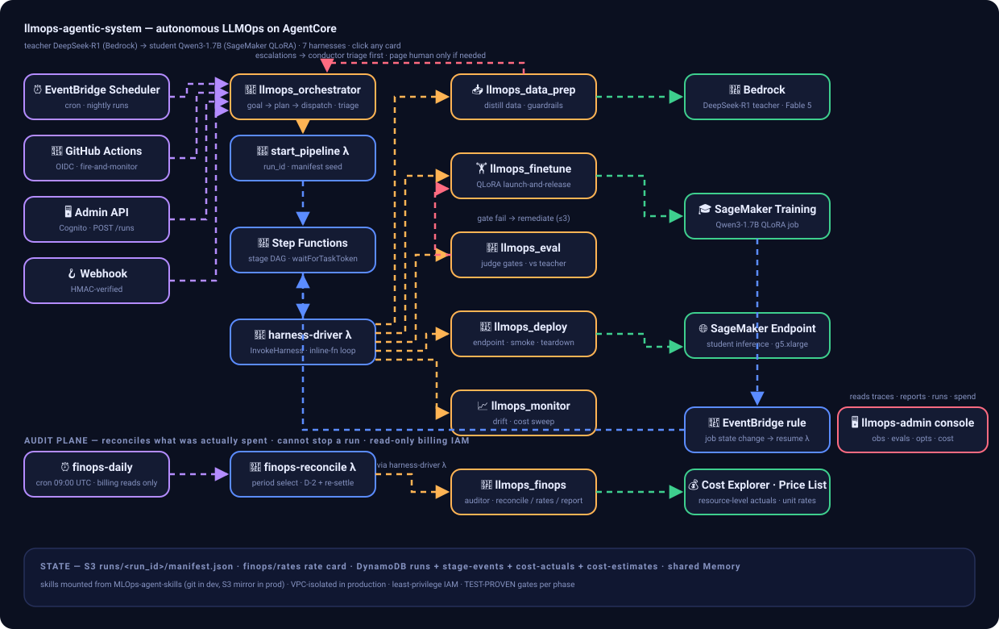
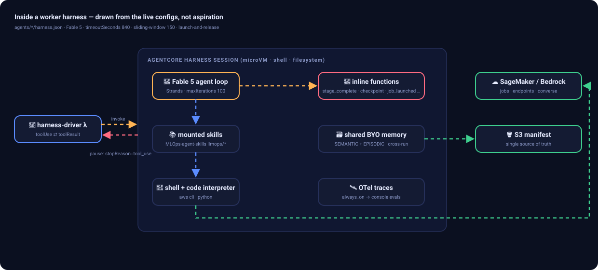

# 架構 —— 設計論證

[English](ARCHITECTURE.md) · [README](../README.zh-TW.md) · [基礎設施](INFRASTRUCTURE.md) · [觸發器](TRIGGERS.zh-TW.md) · [測試結果](TEST_RESULTS.zh-TW.md)

以下每個決策都經過真實 AWS 帳號上的真實調用驗證（證據見
`deploy/evidence/VERIFICATION_phase*.md`）。凡是被實測證據*改變過*的決策，都會引用那次事件。





## 1. 七個 harness（5 個專家 + 1 個指揮家 + 1 個審計員），而非巨型 agent

平台由七個 AgentCore Harness 組成：

| Harness | 角色 | 任務 |
|---|---|---|
| `llmops_data_prep` | 專家 | verify, generate, curate |
| `llmops_finetune` | 專家 | prepare, launch, analyze, remediate |
| `llmops_eval` | 專家 | evaluate, gate |
| `llmops_deploy` | 專家 | deploy, smoke, teardown |
| `llmops_monitor` | 專家 | health, sweep, report |
| `llmops_orchestrator` | **指揮家** | plan, triage, report |
| `llmops_finops` | **審計員** | reconcile, pricing_refresh, report |

為什麼不做一個掛滿所有技能、擁有所有權限的巨型 agent：

- **按階段掛載技能** —— 每個 harness 只掛載自己階段的技能（來自
  [MLOps-agent-skills](https://github.com/timwukp/MLOps-agent-skills)；例如 finetune 掛
  `llm-fine-tuning`、`llm-distillation`、`llm-cost-optimization`，eval 掛
  `llm-evaluation`、`llm-guardrails`）。巨型 agent 的每一輪上下文都得背著全部技能。
- **按階段版本化與 endpoint 釘選** —— 改動 deploy agent 不可能弄壞 data-prep agent；
  每個 harness 獨立版本、獨立釘選。
- **按階段最小權限 IAM** —— 爆炸半徑小。Phase 4 的 teardown 證明了價值：deploy agent
  的 role 被拒絕 `List*`/`DeleteModel`，於是它以已知名稱規劃刪除，並*如實標記*自己
  做不到的部分，而不是默默宣稱完成。
- **按階段評估** —— 線上 evaluation 逐 harness 掛載，質量退化能定位到具體階段。
- **各自誠實** —— Phase 2 pilot：`llm-cost-optimization` 刻意*不*掛在 data-prep 上；
  agent 主動聲明自己無法交叉核對價格，而不是瞎猜。職責分離讓這條邊界成為真的。

指揮家位於狀態機*之上*，而非其中：它把自然語言目標解析成 run plan、派發運行、對
escalation 做第一線 triage、彙總跨運行報告。它不執行管線階段，也不排程運行內的步驟。
配置註釋說得最好：**樂譜不即興，指揮家不吹每個音符**。

## 2. 確定性主幹 + 智能 worker

階段 DAG（data-prep → finetune → eval → deploy → monitor）不會因運行而變 —— 完全不需要
LLM 判斷。因此編排採用 **Step Functions Standard 狀態機**，智能封裝在每個階段*內部*。
讓 LLM 決定「下一個階段是什麼」只會給系統中唯一不需要不確定性的部分添加不確定性、
成本和故障模式。

狀態機（`orchestration/state_machine.asl.json`）在正常路徑上有 **8 個 harness 任務狀態**
—— 每個都是帶 `waitForTaskToken` 的 harness driver Lambda 調用 —— 外加只在迴路中出現的
`RemediateFinetune`：

```
DataPrepGenerate → DataPrepCurate → FinetuneLaunch → FinetuneAnalyze → EvalGate
                                                        │（門檻失敗）
                              RemediateFinetune ←───────┘   …門檻通過則：
                                                     Deploy → SmokeTest → Teardown
```

再加上路由用的控制狀態：`QualityGateChoice`（門檻通過 → Deploy，否則進補救）、
`RemediationChoice`（iteration < 3 → 補救，否則升級人類）、`IncrementIteration`（Pass），
以及終態 `Complete`（發出 `PipelineCompleted`）、`EscalateFail`（發出
`EscalatedToHuman`）、`Fail`。

兩個屬於「政策」而非「管道」的主幹細節：

- **兩條路徑都要關掉兩筆記錄。** 一次 run 會寫兩筆記錄 —— `llmops-pipeline-runs` 裡它自己
  那一列，以及 `llmops-tasks` 裡發起它的那個任務 —— 而兩條路徑都各被抓到只關了其中一筆。
  失敗路徑（`EscalateFail` → `MarkRunFailed` → `MarkTaskFailed`）關了 run 卻沒關 task，
  害 `task-58ecde82adcd73bf` 卡在 `dispatched` 整整一天。接著是成功路徑：`runs.status`
  從頭到尾只被寫過 `running`（start-pipeline）、`escalated`（driver）、`failed`
  （`MarkRunFailed`）—— **沒有任何東西寫過 `completed`**，所以每一次成功的 run 都變成殭屍，
  正是 `MarkRunFailed` 在另一條分支上要防的那件事。它之所以沒被看見，是因為在
  `run-20260801T062313Z-4d3e2e69` 之前**從來沒有一次執行成功過**（6 次失敗、1 次中止）；
  那次 run 的 task 列在 06:34:43Z 正確關閉，而它的 run 列在五小時後仍讀作 `running`。
  現在 `Complete` → **`MarkRunDone`** → `MarkTaskDone` 把它關掉，並帶
  `attribute_not_exists(status) OR status = running` 條件，所以它永遠不可能覆蓋掉更豐富的
  判決；它的 `Catch` 也落到 `MarkTaskDone`，理由和 `MarkRunFailed` 的 `Catch` 一樣 ——
  關不掉其中一筆，不能連另一筆也一起開著。守護測試從 ASL 推導出「誰負責關閉」，而不是寫死名字。
- **deploy 之後必然執行 `Teardown`** —— 即使 `SmokeTest` 失敗，其 `Catch` 也先路由到
  `Teardown`。孤兒 endpoint 是第一大成本風險（Phase 4 就在帳號裡發現一個無關的
  endpoint 自 2024-04 起一直 InService）。
- 主幹同時是**確定性後備**：Phase 3 一次 Bedrock 短暫故障期間，agent 不可達，
  orchestrator 直接提交了訓練作業 `-r5`（標記
  `launched_by: orchestrator-fallback-bedrock-5xx`）。

## 3. Inline-function 契約

Agent 不用自由文本「彙報」—— driver 只信任結構化的 inline-function 呼叫，這是 agent
影響管線的唯一通道。

**Worker 契約**（5 個專家通用）：

| Function | 含義 | Driver 行為 |
|---|---|---|
| `stage_complete` | 階段完成，附 outputs + metrics | **trust-but-verify**：對每個聲稱的 `s3://` 輸出做 `head_object`；缺失 → 呼叫被*駁回*給 agent（「寫出來再呼叫一次」）。規範報告由 driver —— 而非 agent —— 寫入。`outputs: []` 是合法的成功。 |
| `job_launched` | 長作業已發起（SageMaker 訓練） | launch-and-release：把 Step Functions task token 按 job name 停放進 DynamoDB，釋放 session（§4） |
| `checkpoint` | 回合預算將盡，進度已持久化 | 在同一 session 重新調用以繼續（Lambda 本身臨界時自我重調） |
| `escalate_human` | 預算或權限耗盡 | SNS 通知、運行標記 `escalated`、發 `EscalatedToHuman` 事件、task token 置失敗 |

**指揮家契約**（`llmops_orchestrator`）：`launch_run`（經 start-pipeline 派發計劃好的
run）、`resolve_escalation`（政策範圍內第一線處置：調參重跑階段、跳過、有記錄的重試）、
`page_human`（**僅限**超出其權限的決策 —— 預算超支、共享資源刪除、業務取捨 ——
附決策簡報：情勢、選項、建議）、`write_report`（發布跨運行運維彙總），加 `checkpoint`。

**裁決要嘛被投遞，要嘛可見地無法投遞 —— 絕不靜默歸檔。** 回答通道
（`put_directive` → `checkpoint` 分支的 `take_directive`）**只有一個讀者**：一個
*活著的* driver invocation。所以「已投遞」不是寫入的屬性，而是「將來會不會有人去讀」的
屬性 —— 而 `resolve_escalation` 過去兩種情況都回 `{"status": "resolved"}`。這正是那筆
data-prep 預算 escalation 懸了三天的原因：`run-20260729T104648Z-41631739` 早已是
`escalated`，它的 task token 已被 `handle_escalate` 置失敗、execution 也在 11:19:55Z
FAILED，所以今天去 triage 它**會回報成功、然後什麼都不會發生**。那個為了回答 escalation
而存在的工具，回答不了*那一筆* escalation，而且沒有告訴任何人。這與 §4 那個滯留的 task
token 是同一個形狀：**寫入被授權了，但到不了。** 現在 `put_directive` 會先查該 run 的
狀態；終態 run 的裁決仍然會被寫下（決定本身就是證據，即使沒人照它行動），但標記
`deliverable: false`，並且**在同一輪把呼叫駁回**，明確指出仍然能動的路徑 ——
用 `launch_run` 帶著 adjusted params 重跑，或 `page_human`。讀不到或不存在的 run 列
**刻意**算作可投遞：要修的缺陷就是靜默無操作，若因為一次暫時性 DynamoDB 錯誤就扣住裁決，
等於朝同一個方向又造出第二個。

**逃生口必須在真正會用到它的那條路徑上被服務。** 上面那個駁回指出了兩條路，而其中一條
根本沒接線。`page_human` 從 Phase 5 就宣告在 orchestrator harness 上，卻只有 console 的
chat worker 處理它 —— 但 triage 從來不是 chat：`EscalatedToHuman` 事件路由到的是
**driver**，而在 driver 上 `page_human` 落到了未知工具分支，回答
`{"status": "unsupported"}`。沒有 SNS、沒有事件、沒有任何人被通知。2026-08-01 13:45Z
實測，而且是在上面那個修復**已經部署之後**：指揮家被正確告知裁決無法投遞、應改用
`launch_run` 或 `page_human`，於是它改為再次呼叫 `resolve_escalation`、再次被駁回、
把 `plan.json` 與 `relaunch-plan.json` 寫到 S3，然後那一輪就結束了 ——
**零次派發、零次呼叫人類。** 舊的漂移守護測試之所以通過，是因為它只問一個被宣告的工具
有沒有在**任何地方**被服務；console 讓它成立，而只有 driver 會跑 triage。現在守護測試
改為**逐路徑**，並且從 prompt 自己的 triage 條款推導工具清單，所以協議日後多長出第三個
出口，也不可能只接一半。此外，一次 page 若沒有同時帶 `situation` 與 `recommendation`
就會被駁回：把問題丟給 owner 而不附上你已經做完的分析，等於讓他們留在原地。

若一輪結束時*沒有* inline-function 呼叫（模型有時會口頭宣稱完成卻漏掉結構化呼叫），
driver 在同一 session 內最多追問 2 次，然後以 `MissingStageComplete` 判定階段失敗 ——
口頭敘述永遠不會被晉升為成功。

## 4. Launch-and-release 與 EventBridge 喚醒

Harness 一輪有界（約 14 分鐘）；訓練作業跑數小時。規則：**harness 絕不空等作業**。
finetune agent 發起 SageMaker 作業、呼叫 `job_launched`、session 隨即釋放。恢復管線的
鏈路：

1. Driver 把 Step Functions task token 按 job name 停放進 DynamoDB
   （`llmops-pipeline-runs`，GSI `job_name-index`）。
2. 作業終態觸發 "SageMaker Training Job State Change" 的 EventBridge 規則
   （Completed | Failed | Stopped）→ `llmops-resume-pipeline` Lambda。
3. Lambda 按 job name 查回 run，發出 `ModelTrained` / `PipelineFailed`，結算 token
   （`send_task_success` / `send_task_failure`），並**刪除 token** ——
   EventBridge 重複投遞也無法二次結算。這個刪除**與結算隔離**，因為 Step Functions 已經
   丟棄的 token 是過期資料，不是待辦義務：2026-07-29 那次刪除以 `AccessDenied` 失敗，而
   隨後約 5 次 EventBridge 重試全都**更早**就掛了 —— 掛在結算，`TaskTimedOut`
   （「Provided task does not exist anymore」）—— 所以沒有任何一次抵達刪除，
   `run-20260729T104648Z-41631739` 就一直為一個已在 11:19:55Z 結束的 execution 保留著
   `task_token`。補上缺的 IAM 是必要條件但不是充分條件；**IAM 授權能修好「被禁止」的事，
   永遠修不好「到不了」的事。** 現在只吸收「task 已不存在」這一種錯 —— 限流或 5xx 仍然
   重拋而且**不刪除**，因為那個 token 是管線唯一能得知該階段已完成的途徑 —— 而刪除本身
   失敗則是拋出而非吞掉，因為那正是當初「traceback 講的是別的事」的那個失敗。
4. 之後 `FinetuneAnalyze` 在**全新 session** 中運行，從 AWS 狀態
   （describe-training-job + S3 + manifest）重建全部上下文。

Phase 3 實測驗證（觀察到兩次 resume Lambda 調用：一次在早期失敗、一次在成功完成；
時長 1.5 秒、0 錯誤），Phase 5 又兩次全程無人驗證。

## 5. Manifest 是唯一事實來源

**狀態存在 `s3://<bucket>/runs/<run_id>/manifest.json` + DynamoDB，絕不存在 session
裡。** start-pipeline Lambda 播種 manifest（運行參數、模型、門檻、預算）；每個階段
讀取並追加自己的條目；`remediation_history` 只追加不改寫。全部實測驗證過的推論：

- Session 可拋棄：Phase 3 訓練後的 `analyze` 在全新 session 中零上下文損失地運行；
  Phase 2 挺過 3 次客戶端斷流（含一次合蓋關機），零工作損失。
- 擴容是改參數不是改工程：Phase 2 的 24 任務運行與 Phase 5 的 2 樣本 mini-run 只差
  manifest 參數。
- 學習沉澱在下一次運行會去看的地方：Phase 2 的 agent 把 token 預算與 checkpoint
  發現直接記進了 manifest。

## 6. 共享 BYO Memory —— 跨運行學習

一個 AgentCore Memory（`llmops_shared_memory`，策略 **SEMANTIC + EPISODIC**）由七個
harness 共享，由 `deploy/04_wire_memory.py` 在建立後接線。每個 agent 的 `actorId`
（= harness 名稱）為 namespace 分區，檢索仍可跨讀共享事實。刻意跳過
USER_PREFERENCE/SUMMARIZATION 策略 —— 迴路中沒有人類用戶。

這就是 run-N 的學習抵達 run-N+1 的機制，且已被證明：Phase 5 的 e2e 運行中，finetune
agent **首次嘗試即成功**發起訓練作業，用的正是 Phase 3 補救連環戰學到的
floors-only requirements + torch-2.6 DLC 配方 —— 那個配方當初花了 5 個失敗作業才換來。

## 7. Fail-closed 門檻

質量門檻默認 FAIL。這條規則是被實測缺陷逼嚴的（Phase 5，e2e 第 4 輪）：mini-run 的
eval agent 發出 `gate_passed: null` + `needs_human: true`，而舊的 default-True 強轉
*把 null 晉升成了通過*。Driver 的修復：

- eval gate 任務上，`gate_passed` 取 `metrics.get("gate_passed") is True` —— 缺失、
  null、任何非 True 都等於未通過。已加回歸測試。
- Phase 4 以最要緊的方式證明門檻是真的：模型確實失敗了（兩次 0/16，
  `closed_think_rate` 0%），而判決**站住了** —— 沒有被「修」成通過。
  能被說服放行的門檻不是門檻。

## 8. 補救迴路（≤ 3 次迭代）

`QualityGateChoice` 失敗 → `RemediationChoice`：只要 `iteration < 3`，就
`IncrementIteration` → `RemediateFinetune` → 回到 `FinetuneAnalyze` → `EvalGate`。
預算耗盡 → `EscalateFail`。同一預算也寫進 agent 的任務 prompt（「診斷、修正、重試 ——
最多 3 次；然後 `escalate_human`」），機器層與 agent 層的預算一致。

迴路最好的證據是它的誠實邊界（Phase 5，第 5 輪運行）：eval agent 回報
`FAIL_CLOSED_NO_INPUT`（2 樣本規模不存在質量信號），狀態機正確地武裝了
`RemediateFinetune` —— 而 finetune agent 回答
`REMEDIATE_PREMISE_INVALID — no quality signal to remediate` 並升級人類，拒絕在
不可修復的前提上空燒迭代。「誠實優先於忙碌」是設計要求，而迴路為它預留的出口正是
`escalate_human`。

## 9. 模型 failover 是設計層，不是應急手段

實測確立（Phase 5）：供應商模型配額是硬約束 —— 即使 AWS 內部帳號也受模型供應商限流，
而多 agent 平台本身就是 token 洪流製造機（6 個 harness × agent 迴圈 × 長串流）。單日
內 Fable 5 的 5xx 爆發重現約 12 次。設計規則（全文見 [AGENTS.md](../AGENTS.md)）：

1. 每個 harness 都有後備鏈：`global.anthropic.claude-fable-5` →
   `global.anthropic.claude-opus-5`（同家族，零 prompt 改動）。經 `UpdateHarness`
   熱切換，約 15 秒到 READY；session 在切換中存活。
2. 「該切換」的特徵：ConverseStream 反覆拋
   `InternalServerException`/`ServiceUnavailableException`，而同一模型的單發直測卻成功
   —— 這是配額壓力，不是故障（它從不以顯式 ThrottlingException 出現）。
3. **混合配置**從設計上分散配額壓力：判斷密集的 agent（orchestrator、eval）用旗艦檔，
   流程執行型 agent（data-prep、deploy、monitor）用 Opus 5。
4. Driver 在串流搶救時檢測到模型 5xx 即熱切換到後備模型並發出資訊性 failover 事件
   （`orchestration/harness_driver/handler.py` 的 `_maybe_failover_model`）；
   完整的自動 failover 加固屬於 Phase 6。

## 10. Driver 的回合續接設計（900 秒 Lambda vs 840 秒回合）

Harness driver Lambda 是 Step Functions 與 harness 之間的橋：一次調用串流
`InvokeHarness`、服務 toolUse ⇄ toolResult 協議、驗證輸出、結算 task token。算術難題：
Lambda 硬上限 **900 秒**，而 harness 回合預算（`timeoutSeconds`）是 **840 秒** ——
一次調用只裝得下**一輪**。這個設計是被實測證據逼出來的（Phase 5，e2e 第 4 輪）：
`Sandbox.Timedout` 殺掉了一次運行，而那個 agent *已經幹完了活，只是沒等到彙報的
那一輪*。

修復：**輪間自我重調（between-turn self-reinvoke）**。當迴圈將要開始下一輪而剩餘時間
不足時，driver 攜帶續接負載（待發內容 + 重試/追問計數）異步重調自身；確定性 session id
與 task token 跨調用存活，對話從中斷處精確恢復。同一迴圈裡還烙著其他源自真實故障的
生產模式：AgentCore 客戶端 `read_timeout=870, retries=0`（默認 60 秒會殺死長串流；
自動重試會靜默重跑整輪 agent 回合），以及串流中途死亡時同 session 的一次性搶救重試。

## 11. 生產環境的 VPC 態勢

harness 配置（`agents/*/harness.json`）走 PUBLIC 網絡以求迭代速度。VPC 本身由
`deploy/02_network.py` 建立，Lambda 可以**在 VPC 內隔離運行，走 interface
endpoints —— 無互聯網出口**。

**尚未實作**（追蹤於 s3 技能來源的工作項）：VPC 模式的 harness 變體，以及來源本身的**切換**。
它所需要的鏡像現在已經存在 —— `deploy/03_storage.py` 裡的 `ensure_skills` 從 harness 配置
推導出要鏡像什麼、在上傳**之前**驗證每個 `SKILL.md` 的 frontmatter、並且把每一個都讀回來
確認；harness 角色對 `skills/*` 只有 `GetObject` 與 `ListBucket`，沒有寫入權限。
目前 **7 個 harness 上的 19 個技能來源全部是 `git`，沒有一個是 `s3`** ——
由 `tests/test_docs_claims.py::test_the_skill_source_claims_match_the_harness_configs`
讀取實際配置驗證，而不是相信這段文字。本文件的先前版本把
`agents/*/harness.prod.json` 與 `deploy/05_mirror_skills.py` 寫成既有檔案；這兩個檔案
在任何分支都從未存在過，也就是把一個設計當成已交付的功能在讀。

兩個硬性理由讓鏡像成為 VPC 模式的前置條件，而不只是優化：

- VPC 模式的 harness 連不上 GitHub，所以 git 技能來源根本無法解析 —— 而來源錯誤或無法
  連線是在 **session 啟動時**才失敗，不是在 `UpdateHarness` 時，所以 harness 會被接受，
  然後每一次 invocation 都失敗。這個不對稱也讓鏡像的**權限**成為前置條件的一部分，而不是
  後續工作：抓取技能的身分是 `llmops-harness-execution`，所以部署者自己成功讀回上傳的物件
  什麼都證明不了。第一次上傳完成後用 `simulate_principal_policy` 實測，那個角色對它將會被
  要求的那些 key 是**隱性拒絕（implicitDeny）**。
- 這也是正確性問題而不只是連通性：git 技能來源只讀默認分支（沒有 branch 欄位），
  技能 repo 的 main 分支漂移會靜默改變生產 agent 的行為。S3 快照釘死 agent 實際運行的內容。

## 12. 審計員在狀態機之外，而且是唯讀的

`llmops_finops` 是唯一在 run 的階段序列中沒有位置的 harness，而這是從它工作的**形狀**推導
出來的，不是品味問題。

`llmops_monitor` 跑在狀態機**裡面**：每個 run 一次、在該 run 的生命週期內，回答「endpoint
現在還活著嗎」。對帳在三個軸上都是相反的形狀 —— 它在 run **結束之後**才跑（Cost Explorer
延遲約 24 小時）、它**橫跨多個** run、而且它對專案負責而不是對任何單一 run 負責。一個昨天
就結束的 run，沒有任何活著的 agent 能去歸屬今天才結算的帳單；把這件事放進 `monitor`，就等
於讓一個「屬於某個 run」的 agent 去讀其他 run 的資料。

所以它坐在 `llmops_orchestrator` 旁邊、主幹之上：**指揮家決定要花什麼，審計員報告花了什麼。**

它的 IAM 對帳務是唯讀的（`ce:Get*`、`pricing:*`、`budgets:ViewBudget`），且沒有終止任何
東西的權限。有兩個理由，而第二個是承重的那個：

- 審計員不能有能力改變它所審計的對象。
- 停掉一個 run 是 orchestrator 透過 `page_human` 的權限。把終止權交給一個職責是**觀察**的
  元件，會把支出控制的權限放錯位置 —— 而一個能對自己的發現直接動手的審計員，那些發現就
  再也沒有獨立的檢查了。

$2000 審批閘門住在 console 與 `cost_model.py`，不在審計員身上，理由相同：**衡量支出的東西，
不是授權支出的東西。** 見 [COST.zh-TW.md](COST.zh-TW.md)。

全程最小權限 IAM（無 `*FullAccess`），所有資源限定 `llmops-*` 範圍；本 repo 公開：
任何地方不出現帳號 ID —— 部署腳本在運行時替換 `<ACCOUNT_ID>`，由 pre-commit hook 與
CI 遮蔽掃描強制執行。
